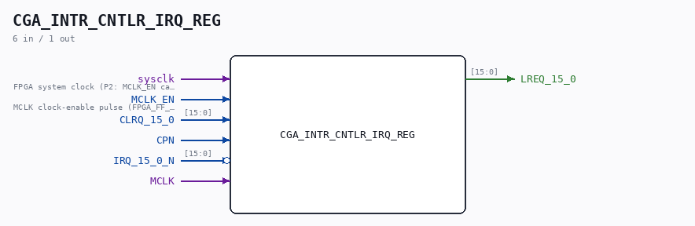

# CGA_INTR_CNTLR_IRQ_REG

Source: `/mnt/e/Dev/Repos/Ronny/nd-120/Verilog/DELILAH-CPU/CGA_INTR/circuit/CGA_INTR_CNTLR_IRQ_REG.v`

> Generated by `Verilog/tests/module_doc.py` from the `//!`
> comments in the source. Do not edit by hand - edit the RTL comments and regenerate.

## Description

ND120 CGA (CPU Gate Array / DELILAH)
/CGA/INTR/CNTLR/IRQ/REG
INTERRUPT CONTROLLER REGISTER
Interrupt latches
Page 78
SHEET 1 of 1
15-JUL-2026: all 16 request bits swapped from RQBIT (async
cross-coupled SR latch) to the loop-free RQBIT_V2 - equivalence
proved in ../sim/CGA_INTR_CNTLR_IRQ_REG_RQBIT_V2_tb.v.
Last reviewed: 15-JUL-2026
Ronny Hansen

## Ports

| Direction | Width | Name | Description |
|---|---|---|---|
| input | `1` | `sysclk` | FPGA system clock (P2: MCLK_EN capture) |
| input | `1` | `MCLK_EN` | MCLK clock-enable pulse (FPGA_FF_MODE, else 0) |
| input | `[15:0]` | `CLRQ_15_0` |  |
| input | `1` | `CPN` |  |
| input | `[15:0]` | `IRQ_15_0_N` *(active low)* |  |
| input | `1` | `MCLK` |  |
| output | `[15:0]` | `LREQ_15_0` |  |
