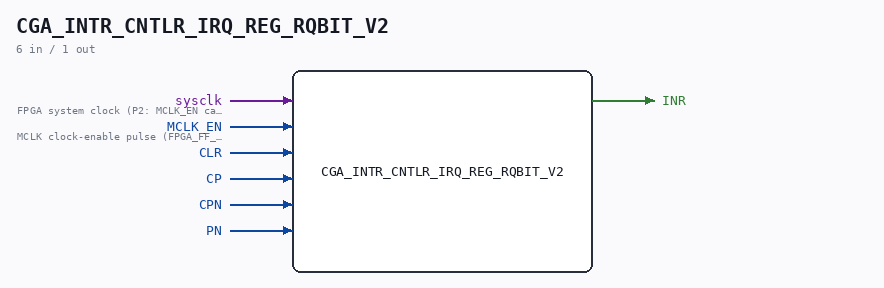

# CGA_INTR_CNTLR_IRQ_REG_RQBIT_V2

Source: `/mnt/e/Dev/Repos/Ronny/nd-120/Verilog/DELILAH-CPU/CGA_INTR/circuit/CGA_INTR_CNTLR_IRQ_REG_RQBIT_V2.v`

> Generated by `Verilog/tests/module_doc.py` from the `//!`
> comments in the source. Do not edit by hand - edit the RTL comments and regenerate.

## Description

ND120 CGA (CPU Gate Array / DELILAH)
/CGA/INTR/CNTLR/IRQ/REG/RQBIT_V2
INTERRUPT CONTROLLER REGISTER Q BIT - loop-free replacement
Page 78
SHEET 1 of 1
Drop-in replacement for CGA_INTR_CNTLR_IRQ_REG_RQBIT with NO
combinational feedback loop. The original holds the request in a
cross-coupled OR/NAND SR latch (s_ff_or_out <-> s_ff_nand_out) that
(a) yosys/nextpnr reject as a combinational loop, (b) oscillates
from X-init in event simulators, and (c) is glitch-sensitive on
real FPGA fabric.
Contract (proved exhaustively against the gate netlist in
../sim/CGA_INTR_CNTLR_IRQ_REG_RQBIT_tb.v and the V2 equivalence tb):
PN  = interrupt request, ACTIVE-LOW  (PN=0 -> request asserted)
CLR = clear line,        ACTIVE-HIGH (dominates)
INR = latched request,   ACTIVE-HIGH
The async latch B catches a request pulse at ANY time (set on
PN=0), is cleared by CLR while CP is low (CPN & CLR, clear
dominates), and the output FF samples
d = ~((~PN | B) & ~CLR) on each rising CP (= MCLK), INR = qBar.
Implementation: B is replaced by a sysclk-clocked catcher flip-flop
with the same set/clear priority - set when PN is low, cleared when
CPN & CLR, clear dominating. It catches any request pulse of at
least one sysclk cycle, which covers the real pulse sources (e.g.
the one-cycle set-request pulses of a PID register write - measured
in the system trace, levels pulse PN low for exactly one sysclk
between MCLK edges). The output FF is the same D_FLIPFLOP_EN as the
original, in the same two build modes (FPGA_FF_MODE: posedge sysclk
gated by MCLK_EN; otherwise posedge CP). No combinational loop
anywhere: both state elements are edge-triggered.
Residual, intentional difference vs the async original (see
../sim/CGA_INTR_CNTLR_IRQ_REG_RQBIT_V2_tb.v): only events narrower
than one sysclk cycle (combinational glitches / delta races) can be
caught by the transparent latch and not by the catcher - on FPGA
fabric that glitch sensitivity is exactly the failure mode this
module removes.
Last reviewed: 15-JUL-2026
Ronny Hansen

## Ports

| Direction | Width | Name | Description |
|---|---|---|---|
| input | `1` | `sysclk` | FPGA system clock (P2: MCLK_EN capture) |
| input | `1` | `MCLK_EN` | MCLK clock-enable pulse (FPGA_FF_MODE, else 0) |
| input | `1` | `CLR` |  |
| input | `1` | `CP` |  |
| input | `1` | `CPN` |  |
| input | `1` | `PN` |  |
| output | `1` | `INR` |  |
