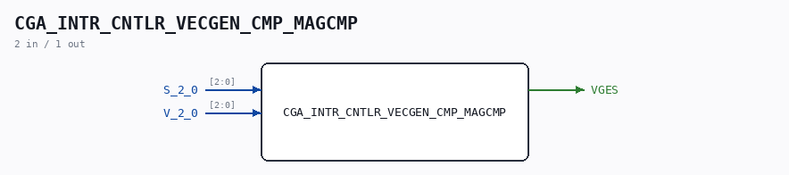

# CGA_INTR_CNTLR_VECGEN_CMP_MAGCMP

Source: `/mnt/e/Dev/Repos/Ronny/nd-120/Verilog/DELILAH-CPU/CGA_INTR/circuit/CGA_INTR_CNTLR_VECGEN_CMP_MAGCMP.v`

> Generated by `Verilog/tests/module_doc.py` from the `//!`
> comments in the source. Do not edit by hand - edit the RTL comments and regenerate.

## Description

ND120 CGA (CPU Gate Array / DELILAH)
/CGA/INTR/CNTLR/VECGEN/CMP/MAGCMP
MAGCMP
Page 88
SHEET 1 of 1
Last reviewed: 10-NOV-2024
Ronny Hansen

## Ports

| Direction | Width | Name | Description |
|---|---|---|---|
| input | `[2:0]` | `S_2_0` |  |
| output | `1` | `VGES` |  |
| input | `[2:0]` | `V_2_0` |  |
