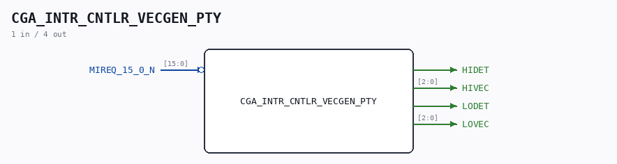

# CGA_INTR_CNTLR_VECGEN_PTY

Source: `/mnt/e/Dev/Repos/Ronny/nd-120/Verilog/DELILAH-CPU/CGA_INTR/circuit/CGA_INTR_CNTLR_VECGEN_PTY.v`

> Generated by `Verilog/tests/module_doc.py` from the `//!`
> comments in the source. Do not edit by hand - edit the RTL comments and regenerate.

## Description

ND120 CGA (CPU Gate Array / DELILAH)
/CGA/INTR/CNTLR/VECGEN/PTY
VECTOR GENERATOR
Page 83
SHEET 1 of 1
Last reviewed: 10-NOV-2024
Ronny Hansen

## Ports

| Direction | Width | Name | Description |
|---|---|---|---|
| input | `[15:0]` | `MIREQ_15_0_N` *(active low)* |  |
| output | `1` | `HIDET` |  |
| output | `[2:0]` | `HIVEC` |  |
| output | `1` | `LODET` |  |
| output | `[2:0]` | `LOVEC` |  |
