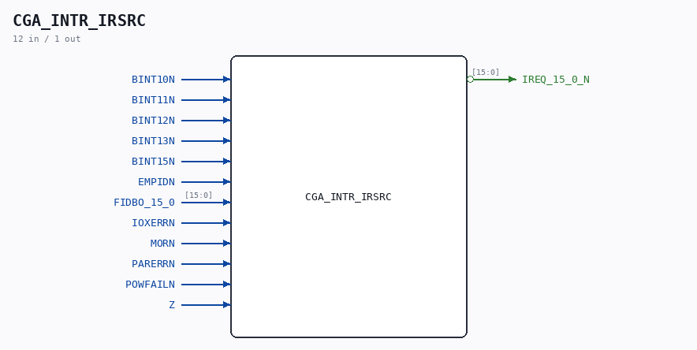

# CGA_INTR_IRSRC

Source: `/mnt/e/Dev/Repos/Ronny/nd-120/Verilog/DELILAH-CPU/CGA_INTR/circuit/CGA_INTR_IRSRC.v`

> Generated by `Verilog/tests/module_doc.py` from the `//!`
> comments in the source. Do not edit by hand - edit the RTL comments and regenerate.

## Description

ND120 CGA (CPU Gate Array / DELILAH)
/CGA/INTR/IRSRC
Interrupt Source
Page 76
SHEET 1 of 1
Last reviewed: 10-NOV-2024
Ronny Hansen

## Ports

| Direction | Width | Name | Description |
|---|---|---|---|
| input | `1` | `BINT10N` |  |
| input | `1` | `BINT11N` |  |
| input | `1` | `BINT12N` |  |
| input | `1` | `BINT13N` |  |
| input | `1` | `BINT15N` |  |
| input | `1` | `EMPIDN` |  |
| input | `[15:0]` | `FIDBO_15_0` |  |
| input | `1` | `IOXERRN` |  |
| input | `1` | `MORN` |  |
| input | `1` | `PARERRN` |  |
| input | `1` | `POWFAILN` |  |
| input | `1` | `Z` |  |
| output | `[15:0]` | `IREQ_15_0_N` *(active low)* |  |
