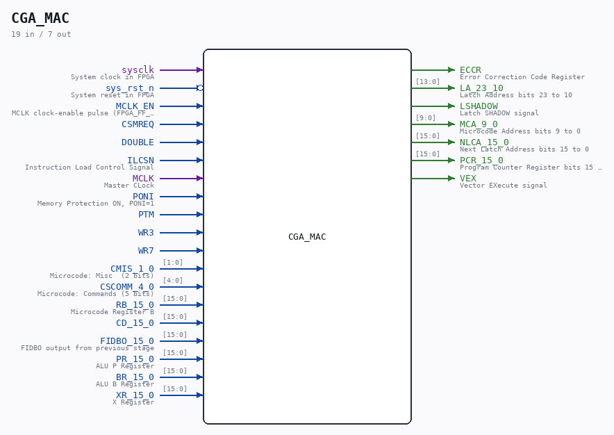

# CGA_MAC

Source: `/mnt/e/Dev/Repos/Ronny/nd-120/Verilog/DELILAH-CPU/CGA_MAC/circuit/CGA_MAC.v`

> Generated by `Verilog/tests/module_doc.py` from the `//!`
> comments in the source. Do not edit by hand - edit the RTL comments and regenerate.

## Description

ND120 CGA (CPU Gate Array / DELILAH)
/CGA/MAC
MAC
Page 24
SHEET 1 of 1
Last reviewed: 9-FEB-2025
Ronny Hansen

## Ports

| Direction | Width | Name | Description |
|---|---|---|---|
| input | `1` | `sysclk` | System clock in FPGA |
| input | `1` | `sys_rst_n` *(active low)* | System reset in FPGA |
| input | `1` | `MCLK_EN` | MCLK clock-enable pulse (FPGA_FF_MODE, else 0) |
| input | `1` | `CSMREQ` |  |
| input | `1` | `DOUBLE` |  |
| input | `1` | `ILCSN` | Instruction Load Control Signal |
| input | `1` | `MCLK` | Master CLock |
| input | `1` | `PONI` | Memory Protection ON, PONI=1 |
| input | `1` | `PTM` |  |
| input | `1` | `WR3` |  |
| input | `1` | `WR7` |  |
| input | `[1:0]` | `CMIS_1_0` | Microcode: Misc  (2 bits) |
| input | `[4:0]` | `CSCOMM_4_0` | Microcode: Commands (5 bits) |
| input | `[15:0]` | `RB_15_0` | Microcode Register B |
| input | `[15:0]` | `CD_15_0` |  |
| input | `[15:0]` | `FIDBO_15_0` | FIDBO output from previous stage |
| input | `[15:0]` | `PR_15_0` | ALU P Register |
| input | `[15:0]` | `BR_15_0` | ALU B Register |
| input | `[15:0]` | `XR_15_0` | X Register |
| output | `1` | `ECCR` | Error Correction Code Register |
| output | `[13:0]` | `LA_23_10` | Latch Address bits 23 to 10 |
| output | `1` | `LSHADOW` | Latch SHADOW signal |
| output | `[9:0]` | `MCA_9_0` | Microcode Address bits 9 to 0 |
| output | `[15:0]` | `NLCA_15_0` | Next Latch Address bits 15 to 0 |
| output | `[15:0]` | `PCR_15_0` | Program Counter Register bits 15 to 0 |
| output | `1` | `VEX` | Vector EXecute signal |
