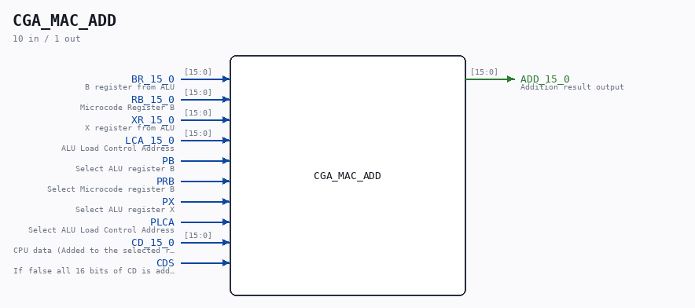

# CGA_MAC_ADD

Source: `/mnt/e/Dev/Repos/Ronny/nd-120/Verilog/DELILAH-CPU/CGA_MAC/circuit/CGA_MAC_ADD.v`

> Generated by `Verilog/tests/module_doc.py` from the `//!`
> comments in the source. Do not edit by hand - edit the RTL comments and regenerate.

## Description

ND120 CGA (CPU Gate Array / DELILAH)
/CGA/MAC/ADD
ADD
Page 29
SHEET 1 of 1
Last reviewed: 02-FEB-2025
Ronny Hansen

## Ports

| Direction | Width | Name | Description |
|---|---|---|---|
| input | `[15:0]` | `BR_15_0` | B register from ALU |
| input | `[15:0]` | `RB_15_0` | Microcode Register B |
| input | `[15:0]` | `XR_15_0` | X register from ALU |
| input | `[15:0]` | `LCA_15_0` | ALU Load Control Address |
| input | `1` | `PB` | Select ALU register B |
| input | `1` | `PRB` | Select Microcode register B |
| input | `1` | `PX` | Select ALU register X |
| input | `1` | `PLCA` | Select ALU Load Control Address |
| input | `[15:0]` | `CD_15_0` | CPU data (Added to the selected register) |
| input | `1` | `CDS` | If false all 16 bits of CD is added. If true, only the low 8 bits are added. |
| output | `[15:0]` | `ADD_15_0` | Addition result output |
