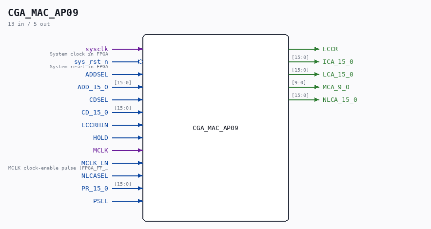

# CGA_MAC_AP09

Source: `/mnt/e/Dev/Repos/Ronny/nd-120/Verilog/DELILAH-CPU/CGA_MAC/circuit/CGA_MAC_AP09.v`

> Generated by `Verilog/tests/module_doc.py` from the `//!`
> comments in the source. Do not edit by hand - edit the RTL comments and regenerate.

## Description

ND120 CGA (CPU Gate Array / DELILAH)
/CGA/MAC/AP09
AP09
Page 31
SHEET 1 of 1
Last reviewed: 14-DEC-2024
Ronny Hansen

## Ports

| Direction | Width | Name | Description |
|---|---|---|---|
| input | `1` | `sysclk` | System clock in FPGA |
| input | `1` | `sys_rst_n` *(active low)* | System reset in FPGA |
| input | `1` | `ADDSEL` |  |
| input | `[15:0]` | `ADD_15_0` |  |
| input | `1` | `CDSEL` |  |
| input | `[15:0]` | `CD_15_0` |  |
| input | `1` | `ECCRHIN` |  |
| input | `1` | `HOLD` |  |
| input | `1` | `MCLK` |  |
| input | `1` | `MCLK_EN` | MCLK clock-enable pulse (FPGA_FF_MODE, else 0) |
| input | `1` | `NLCASEL` |  |
| input | `[15:0]` | `PR_15_0` |  |
| input | `1` | `PSEL` |  |
| output | `1` | `ECCR` |  |
| output | `[15:0]` | `ICA_15_0` |  |
| output | `[15:0]` | `LCA_15_0` |  |
| output | `[9:0]` | `MCA_9_0` |  |
| output | `[15:0]` | `NLCA_15_0` |  |
