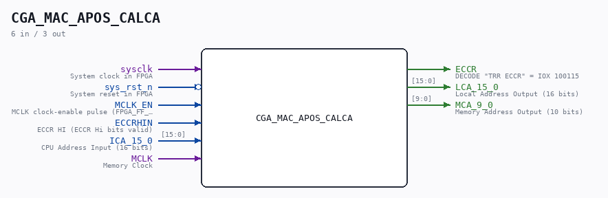

# CGA_MAC_APOS_CALCA

Source: `/mnt/e/Dev/Repos/Ronny/nd-120/Verilog/DELILAH-CPU/CGA_MAC/circuit/CGA_MAC_APOS_CALCA.v`

> Generated by `Verilog/tests/module_doc.py` from the `//!`
> comments in the source. Do not edit by hand - edit the RTL comments and regenerate.

## Description

ND120 CGA (CPU Gate Array / DELILAH)
/CGA/MAC/APOS/CALCA
CALCA
This module decodes the ECCR IOX register and generates
the local address (LCA) and memory address (MCA)
LCA source is ICA and is latched when MCLK is low
MCA source is ICA, and is latched on posedge on MCLK
Page 32
SHEET 1 of 1
Last reviewed: 9-FEB-2025
Ronny Hansen

## Ports

| Direction | Width | Name | Description |
|---|---|---|---|
| input | `1` | `sysclk` | System clock in FPGA |
| input | `1` | `sys_rst_n` *(active low)* | System reset in FPGA |
| input | `1` | `MCLK_EN` | MCLK clock-enable pulse (FPGA_FF_MODE, else 0) |
| input | `1` | `ECCRHIN` | ECCR HI (ECCR Hi bits valid) |
| input | `[15:0]` | `ICA_15_0` | CPU Address Input (16 bits) |
| input | `1` | `MCLK` | Memory Clock |
| output | `1` | `ECCR` | DECODE "TRR ECCR" = IOX 100115 |
| output | `[15:0]` | `LCA_15_0` | Local Address Output (16 bits) |
| output | `[9:0]` | `MCA_9_0` | Memory Address Output (10 bits) |
