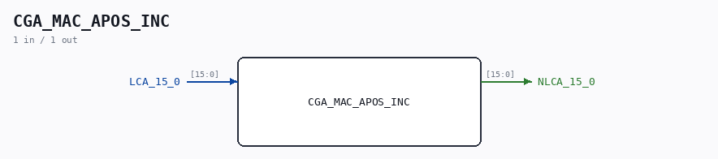

# CGA_MAC_APOS_INC

Source: `/mnt/e/Dev/Repos/Ronny/nd-120/Verilog/DELILAH-CPU/CGA_MAC/circuit/CGA_MAC_APOS_INC.v`

> Generated by `Verilog/tests/module_doc.py` from the `//!`
> comments in the source. Do not edit by hand - edit the RTL comments and regenerate.

## Description

ND120 CGA (CPU Gate Array / DELILAH)
/CGA/MAC/APOS/INC
INCREMENT
Page 33
SHEET 1 of 1
Last reviewed: 01-FEB-2025
Ronny Hansen

## Ports

| Direction | Width | Name | Description |
|---|---|---|---|
| input | `[15:0]` | `LCA_15_0` |  |
| output | `[15:0]` | `NLCA_15_0` |  |
