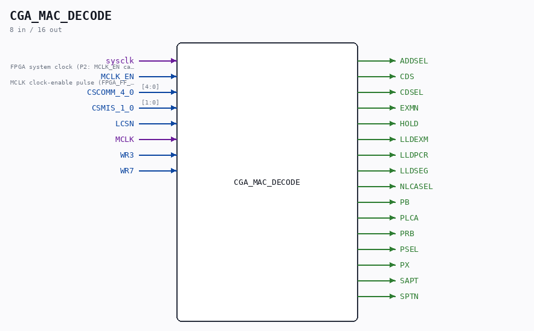

# CGA_MAC_DECODE

Source: `/mnt/e/Dev/Repos/Ronny/nd-120/Verilog/DELILAH-CPU/CGA_MAC/circuit/CGA_MAC_DECODE.v`

> Generated by `Verilog/tests/module_doc.py` from the `//!`
> comments in the source. Do not edit by hand - edit the RTL comments and regenerate.

## Description

ND120 CGA (CPU Gate Array / DELILAH)
/CGA/MAC/DECODE
INCREMENT
Page 25-28
SHEET 1-4
Last reviewed: 10-NOV-2024
Ronny Hansen

## Ports

| Direction | Width | Name | Description |
|---|---|---|---|
| input | `1` | `sysclk` | FPGA system clock (P2: MCLK_EN capture) |
| input | `1` | `MCLK_EN` | MCLK clock-enable pulse (FPGA_FF_MODE, else 0) |
| input | `[4:0]` | `CSCOMM_4_0` |  |
| input | `[1:0]` | `CSMIS_1_0` |  |
| input | `1` | `LCSN` |  |
| input | `1` | `MCLK` |  |
| input | `1` | `WR3` |  |
| input | `1` | `WR7` |  |
| output | `1` | `ADDSEL` |  |
| output | `1` | `CDS` |  |
| output | `1` | `CDSEL` |  |
| output | `1` | `EXMN` |  |
| output | `1` | `HOLD` |  |
| output | `1` | `LLDEXM` |  |
| output | `1` | `LLDPCR` |  |
| output | `1` | `LLDSEG` |  |
| output | `1` | `NLCASEL` |  |
| output | `1` | `PB` |  |
| output | `1` | `PLCA` |  |
| output | `1` | `PRB` |  |
| output | `1` | `PSEL` |  |
| output | `1` | `PX` |  |
| output | `1` | `SAPT` |  |
| output | `1` | `SPTN` |  |
