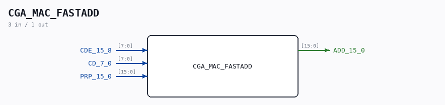

# CGA_MAC_FASTADD

Source: `/mnt/e/Dev/Repos/Ronny/nd-120/Verilog/DELILAH-CPU/CGA_MAC/circuit/CGA_MAC_FASTADD.v`

> Generated by `Verilog/tests/module_doc.py` from the `//!`
> comments in the source. Do not edit by hand - edit the RTL comments and regenerate.

## Description

ND120 CGA (CPU Gate Array / DELILAH)
/CGA/MAC/ADD/FASTADD
ADD
Page 30
SHEET 1 of 1
Last reviewed: 10-NOV-2024
Ronny Hansen

## Ports

| Direction | Width | Name | Description |
|---|---|---|---|
| input | `[7:0]` | `CDE_15_8` |  |
| input | `[7:0]` | `CD_7_0` |  |
| input | `[15:0]` | `PRP_15_0` |  |
| output | `[15:0]` | `ADD_15_0` |  |
