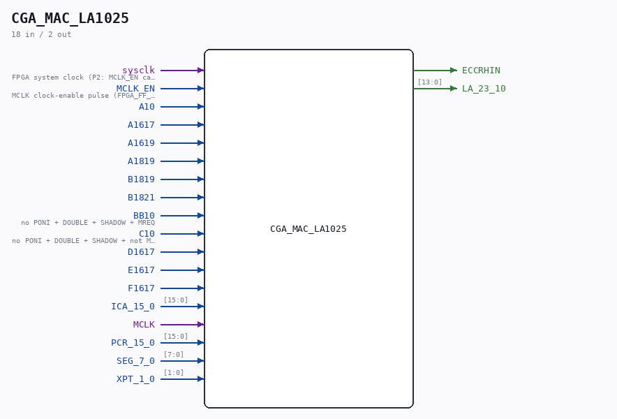

# CGA_MAC_LA1025

Source: `/mnt/e/Dev/Repos/Ronny/nd-120/Verilog/DELILAH-CPU/CGA_MAC/circuit/CGA_MAC_LA1025.v`

> Generated by `Verilog/tests/module_doc.py` from the `//!`
> comments in the source. Do not edit by hand - edit the RTL comments and regenerate.

## Description

ND120 CGA (CPU Gate Array / DELILAH)
/CGA/MAC/LA1025
ADD
Page 40
SHEET 1 of 1
Last reviewed: 02-FEB-2025
Ronny Hansen
02-FEB-2025 - Refactored and removed input bus PCR_15_0_N.
(Use bus PCR_15_0 only)

## Ports

| Direction | Width | Name | Description |
|---|---|---|---|
| input | `1` | `sysclk` | FPGA system clock (P2: MCLK_EN capture) |
| input | `1` | `MCLK_EN` | MCLK clock-enable pulse (FPGA_FF_MODE, else 0) |
| input | `1` | `A10` |  |
| input | `1` | `A1617` |  |
| input | `1` | `A1619` |  |
| input | `1` | `A1819` |  |
| input | `1` | `B1819` |  |
| input | `1` | `B1821` |  |
| input | `1` | `BB10` | no PONI + DOUBLE + SHADOW + MREQ |
| input | `1` | `C10` | no PONI + DOUBLE + SHADOW + not MREQ |
| input | `1` | `D1617` |  |
| input | `1` | `E1617` |  |
| input | `1` | `F1617` |  |
| input | `[15:0]` | `ICA_15_0` |  |
| input | `1` | `MCLK` |  |
| input | `[15:0]` | `PCR_15_0` |  |
| input | `[7:0]` | `SEG_7_0` |  |
| input | `[1:0]` | `XPT_1_0` |  |
| output | `1` | `ECCRHIN` |  |
| output | `[13:0]` | `LA_23_10` |  |
