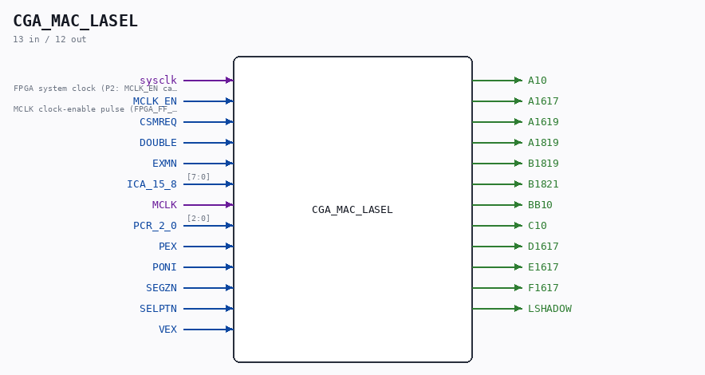

# CGA_MAC_LASEL

Source: `/mnt/e/Dev/Repos/Ronny/nd-120/Verilog/DELILAH-CPU/CGA_MAC/circuit/CGA_MAC_LASEL.v`

> Generated by `Verilog/tests/module_doc.py` from the `//!`
> comments in the source. Do not edit by hand - edit the RTL comments and regenerate.

## Description

ND120 CGA (CPU Gate Array / DELILAH)
/CGA/MAC/LASEL
LASEL
Page 39
SHEET 1 of 1
Last reviewed: 02-FEB-2025
Ronny Hansen
02-FEB-2025 - Refactored and renamed PCR_15_7_2_0 to PCR_2_0
Refactored ICA_15_8 to use 8 bits, not 16

## Ports

| Direction | Width | Name | Description |
|---|---|---|---|
| input | `1` | `sysclk` | FPGA system clock (P2: MCLK_EN capture) |
| input | `1` | `MCLK_EN` | MCLK clock-enable pulse (FPGA_FF_MODE, else 0) |
| input | `1` | `CSMREQ` |  |
| input | `1` | `DOUBLE` |  |
| input | `1` | `EXMN` |  |
| input | `[7:0]` | `ICA_15_8` |  |
| input | `1` | `MCLK` |  |
| input | `[2:0]` | `PCR_2_0` |  |
| input | `1` | `PEX` |  |
| input | `1` | `PONI` |  |
| input | `1` | `SEGZN` |  |
| input | `1` | `SELPTN` |  |
| input | `1` | `VEX` |  |
| output | `1` | `A10` |  |
| output | `1` | `A1617` |  |
| output | `1` | `A1619` |  |
| output | `1` | `A1819` |  |
| output | `1` | `B1819` |  |
| output | `1` | `B1821` |  |
| output | `1` | `BB10` |  |
| output | `1` | `C10` |  |
| output | `1` | `D1617` |  |
| output | `1` | `E1617` |  |
| output | `1` | `F1617` |  |
| output | `1` | `LSHADOW` |  |
