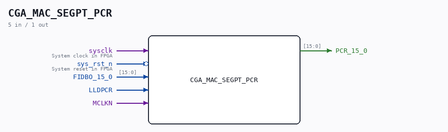

# CGA_MAC_SEGPT_PCR

Source: `/mnt/e/Dev/Repos/Ronny/nd-120/Verilog/DELILAH-CPU/CGA_MAC/circuit/CGA_MAC_SEGPT_PCR.v`

> Generated by `Verilog/tests/module_doc.py` from the `//!`
> comments in the source. Do not edit by hand - edit the RTL comments and regenerate.

## Description

ND120 CGA (CPU Gate Array / DELILAH)
/CGA/MAC/SEGPT/PCR
PCR REGISTER
Page 37
SHEET 1 of 1
Last reviewed: 9-FEB-2025
Ronny Hansen
02-FEB-2025 - Refactored and renamed FIDBO_15_7_2_0 to FIDBO_15_0
Refactored and merged output PCR_14_13_10_9_N and
PCR_15_7_2_0 to PCR_15_0

## Ports

| Direction | Width | Name | Description |
|---|---|---|---|
| input | `1` | `sysclk` | System clock in FPGA |
| input | `1` | `sys_rst_n` *(active low)* | System reset in FPGA |
| input | `[15:0]` | `FIDBO_15_0` |  |
| input | `1` | `LLDPCR` |  |
| input | `1` | `MCLKN` |  |
| output | `[15:0]` | `PCR_15_0` |  |
