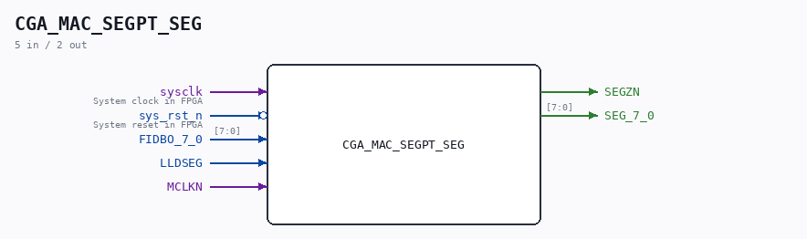

# CGA_MAC_SEGPT_SEG

Source: `/mnt/e/Dev/Repos/Ronny/nd-120/Verilog/DELILAH-CPU/CGA_MAC/circuit/CGA_MAC_SEGPT_SEG.v`

> Generated by `Verilog/tests/module_doc.py` from the `//!`
> comments in the source. Do not edit by hand - edit the RTL comments and regenerate.

## Description

ND120 CGA (CPU Gate Array / DELILAH)
/CGA/MAC/SEGPT/SEG
SEGMENT REGISTER
Page 36
SHEET 1 of 1
Last reviewed: 9-FEB-2025
Ronny Hansen

## Ports

| Direction | Width | Name | Description |
|---|---|---|---|
| input | `1` | `sysclk` | System clock in FPGA |
| input | `1` | `sys_rst_n` *(active low)* | System reset in FPGA |
| input | `[7:0]` | `FIDBO_7_0` |  |
| input | `1` | `LLDSEG` |  |
| input | `1` | `MCLKN` |  |
| output | `1` | `SEGZN` |  |
| output | `[7:0]` | `SEG_7_0` |  |
