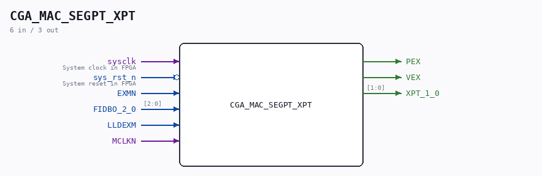

# CGA_MAC_SEGPT_XPT

Source: `/mnt/e/Dev/Repos/Ronny/nd-120/Verilog/DELILAH-CPU/CGA_MAC/circuit/CGA_MAC_SEGPT_XPT.v`

> Generated by `Verilog/tests/module_doc.py` from the `//!`
> comments in the source. Do not edit by hand - edit the RTL comments and regenerate.

## Description

ND120 CGA (CPU Gate Array / DELILAH)
/CGA/MAC/SEGPT/XPT
XPT
Page 38
SHEET 1 of 1
Last reviewed: 9-FEB-2025
Ronny Hansen

## Ports

| Direction | Width | Name | Description |
|---|---|---|---|
| input | `1` | `sysclk` | System clock in FPGA |
| input | `1` | `sys_rst_n` *(active low)* | System reset in FPGA |
| input | `1` | `EXMN` |  |
| input | `[2:0]` | `FIDBO_2_0` |  |
| input | `1` | `LLDEXM` |  |
| input | `1` | `MCLKN` |  |
| output | `1` | `PEX` |  |
| output | `1` | `VEX` |  |
| output | `[1:0]` | `XPT_1_0` |  |
