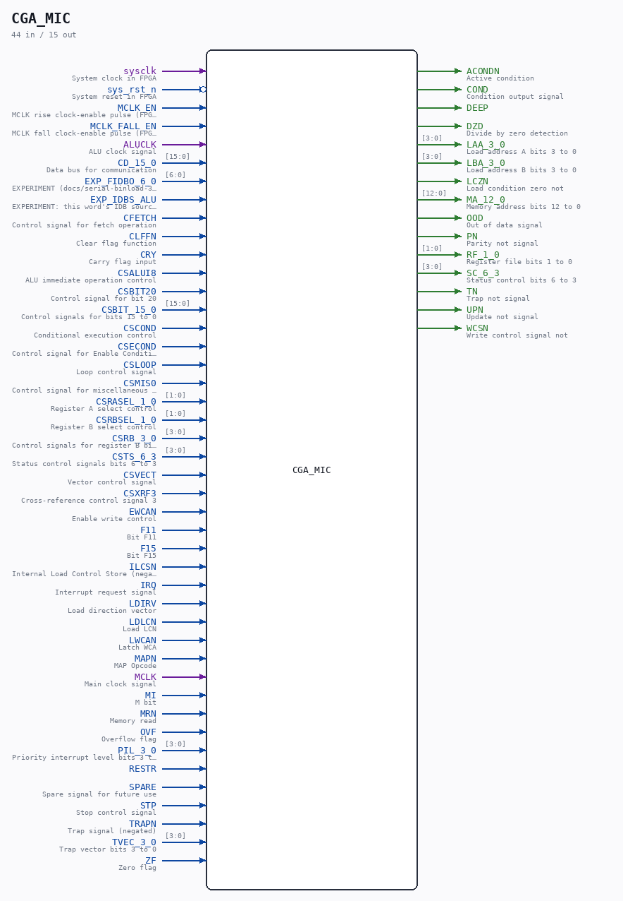

# CGA_MIC

Source: `/mnt/e/Dev/Repos/Ronny/nd-120/Verilog/DELILAH-CPU/CGA_MIC/circuit/CGA_MIC.v`

> Generated by `Verilog/tests/module_doc.py` from the `//!`
> comments in the source. Do not edit by hand - edit the RTL comments and regenerate.

## Description

ND120 CGA (CPU Gate Array / DELILAH)
/CGA/MIC
MIC
Page 9-13
SHEET 1 of 4
Last reviewed: 9-FEB-2025
Ronny Hansen

## Ports

| Direction | Width | Name | Description |
|---|---|---|---|
| input | `1` | `sysclk` | System clock in FPGA |
| input | `1` | `sys_rst_n` *(active low)* | System reset in FPGA |
| input | `1` | `MCLK_EN` | MCLK rise clock-enable pulse (FPGA_FF_MODE, else 0) |
| input | `1` | `MCLK_FALL_EN` | MCLK fall clock-enable pulse (FPGA_FF_MODE, else 0) |
| input | `1` | `ALUCLK` | ALU clock signal |
| input | `[15:0]` | `CD_15_0` | Data bus for communication |
| input | `[6:0]` | `EXP_FIDBO_6_0` | EXPERIMENT (docs/serial-binload-300.md): internal |
| input | `1` | `EXP_IDBS_ALU` | EXPERIMENT: this word's IDB source is the ALU |
| input | `1` | `CFETCH` | Control signal for fetch operation |
| input | `1` | `CLFFN` | Clear flag function |
| input | `1` | `CRY` | Carry flag input |
| input | `1` | `CSALUI8` | ALU immediate operation control |
| input | `1` | `CSBIT20` | Control signal for bit 20 |
| input | `[15:0]` | `CSBIT_15_0` | Control signals for bits 15 to 0 |
| input | `1` | `CSCOND` | Conditional execution control |
| input | `1` | `CSECOND` | Control signal for Enable Condition |
| input | `1` | `CSLOOP` | Loop control signal |
| input | `1` | `CSMIS0` | Control signal for miscellaneous operation bit 0 |
| input | `[1:0]` | `CSRASEL_1_0` | Register A select control |
| input | `[1:0]` | `CSRBSEL_1_0` | Register B select control |
| input | `[3:0]` | `CSRB_3_0` | Control signals for register B bits 3 to 0 |
| input | `[3:0]` | `CSTS_6_3` | Status control signals bits 6 to 3 |
| input | `1` | `CSVECT` | Vector control signal |
| input | `1` | `CSXRF3` | Cross-reference control signal 3 |
| input | `1` | `EWCAN` | Enable write control |
| input | `1` | `F11` | Bit F11 |
| input | `1` | `F15` | Bit F15 |
| input | `1` | `ILCSN` | Internal Load Control Store (negated) |
| input | `1` | `IRQ` | Interrupt request signal |
| input | `1` | `LDIRV` | Load direction vector |
| input | `1` | `LDLCN` | Load LCN |
| input | `1` | `LWCAN` | Latch WCA |
| input | `1` | `MAPN` | MAP Opcode |
| input | `1` | `MCLK` | Main clock signal |
| input | `1` | `MI` | M bit |
| input | `1` | `MRN` | Memory read |
| input | `1` | `OVF` | Overflow flag |
| input | `[3:0]` | `PIL_3_0` | Priority interrupt level bits 3 to 0 |
| input | `1` | `RESTR` |  |
| input | `1` | `SPARE` | Spare signal for future use |
| input | `1` | `STP` | Stop control signal |
| input | `1` | `TRAPN` | Trap signal (negated) |
| input | `[3:0]` | `TVEC_3_0` | Trap vector bits 3 to 0 |
| input | `1` | `ZF` | Zero flag |
| output | `1` | `ACONDN` | Active condition |
| output | `1` | `COND` | Condition output signal |
| output | `1` | `DEEP` |  |
| output | `1` | `DZD` | Divide by zero detection |
| output | `[3:0]` | `LAA_3_0` | Load address A bits 3 to 0 |
| output | `[3:0]` | `LBA_3_0` | Load address B bits 3 to 0 |
| output | `1` | `LCZN` | Load condition zero not |
| output | `[12:0]` | `MA_12_0` | Memory address bits 12 to 0 |
| output | `1` | `OOD` | Out of data signal |
| output | `1` | `PN` | Parity not signal |
| output | `[1:0]` | `RF_1_0` | Register file bits 1 to 0 |
| output | `[3:0]` | `SC_6_3` | Status control bits 6 to 3 |
| output | `1` | `TN` | Trap not signal |
| output | `1` | `UPN` | Update not signal |
| output | `1` | `WCSN` | Write control signal not |
