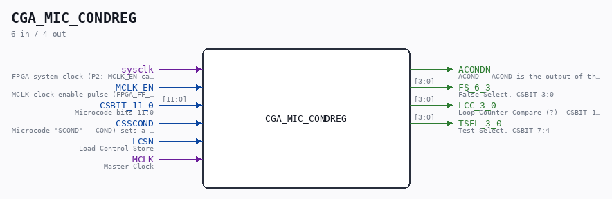

# CGA_MIC_CONDREG

Source: `/mnt/e/Dev/Repos/Ronny/nd-120/Verilog/DELILAH-CPU/CGA_MIC/circuit/CGA_MIC_CONDREG.v`

> Generated by `Verilog/tests/module_doc.py` from the `//!`
> comments in the source. Do not edit by hand - edit the RTL comments and regenerate.

## Description

ND120 CGA (CPU Gate Array / DELILAH)
/CGA/MIC/CONDREG
CONDITION REGISTER
Page 15
SHEET 1 of 1
Last reviewed: 20-DEC-2024
Ronny Hansen

## Ports

| Direction | Width | Name | Description |
|---|---|---|---|
| input | `1` | `sysclk` | FPGA system clock (P2: MCLK_EN capture) |
| input | `1` | `MCLK_EN` | MCLK clock-enable pulse (FPGA_FF_MODE, else 0) |
| input | `[11:0]` | `CSBIT_11_0` | Microcode bits 11:0 |
| input | `1` | `CSSCOND` | Microcode "SCOND" - COND) sets a 4-bit condition-code to be tested on a later occasion. |
| input | `1` | `LCSN` | Load Control Store |
| input | `1` | `MCLK` | Master Clock |
| output | `1` | `ACONDN` | ACOND - ACOND is the output of the condition register. Input to PAL 44403 in Cycle Control to control DLY0 signal |
| output | `[3:0]` | `FS_6_3` | False Select. CSBIT 3:0 |
| output | `[3:0]` | `LCC_3_0` | Loop Counter Compare (?)  CSBIT 11:8 |
| output | `[3:0]` | `TSEL_3_0` | Test Select. CSBIT 7:4 |
