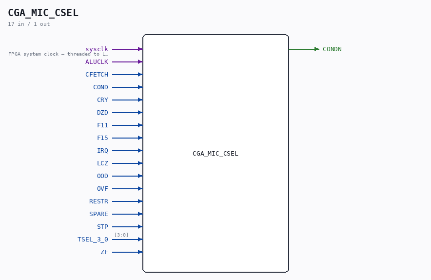

# CGA_MIC_CSEL

Source: `/mnt/e/Dev/Repos/Ronny/nd-120/Verilog/DELILAH-CPU/CGA_MIC/circuit/CGA_MIC_CSEL.v`

> Generated by `Verilog/tests/module_doc.py` from the `//!`
> comments in the source. Do not edit by hand - edit the RTL comments and regenerate.

## Description

ND120 CGA (CPU Gate Array / DELILAH)
/CGA/MIC/CSEL
CONDITION SELECT
Page 14
SHEET 1 of 1
Last reviewed: 10-NOV-2024
Ronny Hansen

## Ports

| Direction | Width | Name | Description |
|---|---|---|---|
| input | `1` | `sysclk` | FPGA system clock — threaded to LATCH |
| input | `1` | `ALUCLK` |  |
| input | `1` | `CFETCH` |  |
| input | `1` | `COND` |  |
| input | `1` | `CRY` |  |
| input | `1` | `DZD` |  |
| input | `1` | `F11` |  |
| input | `1` | `F15` |  |
| input | `1` | `IRQ` |  |
| input | `1` | `LCZ` |  |
| input | `1` | `OOD` |  |
| input | `1` | `OVF` |  |
| input | `1` | `RESTR` |  |
| input | `1` | `SPARE` |  |
| input | `1` | `STP` |  |
| input | `[3:0]` | `TSEL_3_0` |  |
| input | `1` | `ZF` |  |
| output | `1` | `CONDN` |  |
