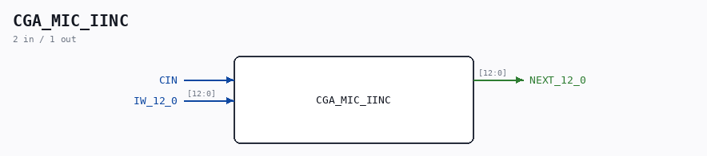

# CGA_MIC_IINC

Source: `/mnt/e/Dev/Repos/Ronny/nd-120/Verilog/DELILAH-CPU/CGA_MIC/circuit/CGA_MIC_IINC.v`

> Generated by `Verilog/tests/module_doc.py` from the `//!`
> comments in the source. Do not edit by hand - edit the RTL comments and regenerate.

## Description

ND120 CGA (CPU Gate Array / DELILAH)
/CGA/MIC/IINC
INSTRUCTION INCREMENT
Page 16
SHEET 1 of 1
Last reviewed: 01-FEB-2025
Ronny Hansen

## Ports

| Direction | Width | Name | Description |
|---|---|---|---|
| input | `1` | `CIN` |  |
| input | `[12:0]` | `IW_12_0` |  |
| output | `[12:0]` | `NEXT_12_0` |  |
