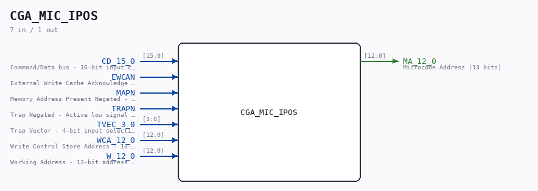

# CGA_MIC_IPOS

Source: `/mnt/e/Dev/Repos/Ronny/nd-120/Verilog/DELILAH-CPU/CGA_MIC/circuit/CGA_MIC_IPOS.v`

> Generated by `Verilog/tests/module_doc.py` from the `//!`
> comments in the source. Do not edit by hand - edit the RTL comments and regenerate.

## Description

ND120 CGA (CPU Gate Array / DELILAH)
/CGA/MIC/IPOS
INSTRUCTION POSITION
Page 22
SHEET 1 of 1
Last reviewed: 02-FEB-2025
Ronny Hansen

## Ports

| Direction | Width | Name | Description |
|---|---|---|---|
| input | `[15:0]` | `CD_15_0` | Command/Data bus - 16-bit input carrying instruction/data |
| input | `1` | `EWCAN` | External Write Cache Acknowledge Negated - Active low signal indicating cache write completion |
| input | `1` | `MAPN` | Memory Address Present Negated - Active low signal indicating valid memory address |
| input | `1` | `TRAPN` | Trap Negated - Active low signal indicating trap condition |
| input | `[3:0]` | `TVEC_3_0` | Trap Vector - 4-bit input selecting trap handling routine address |
| input | `[12:0]` | `WCA_12_0` | Write Control Store Address - 13-bit address for writing to control store |
| input | `[12:0]` | `W_12_0` | Working Address - 13-bit address used during normal operation |
| output | `[12:0]` | `MA_12_0` | Microcode Address (13 bits) |
