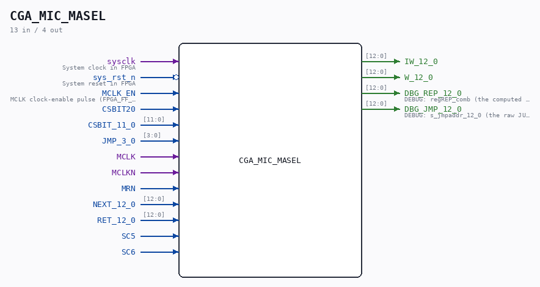

# CGA_MIC_MASEL

Source: `/mnt/e/Dev/Repos/Ronny/nd-120/Verilog/DELILAH-CPU/CGA_MIC/circuit/CGA_MIC_MASEL.v`

> Generated by `Verilog/tests/module_doc.py` from the `//!`
> comments in the source. Do not edit by hand - edit the RTL comments and regenerate.

## Description

ND120 CGA (CPU Gate Array / DELILAH)
/CGA/MIC/MASEL
Microcode Address SELECT
Page 19
SHEET 1 of 1
Last reviewed: 22-MARCH 2025
Ronny Hansen

## Ports

| Direction | Width | Name | Description |
|---|---|---|---|
| input | `1` | `sysclk` | System clock in FPGA |
| input | `1` | `sys_rst_n` *(active low)* | System reset in FPGA |
| input | `1` | `MCLK_EN` | MCLK clock-enable pulse (FPGA_FF_MODE, else 0) |
| input | `1` | `CSBIT20` |  |
| input | `[11:0]` | `CSBIT_11_0` |  |
| input | `[3:0]` | `JMP_3_0` |  |
| input | `1` | `MCLK` |  |
| input | `1` | `MCLKN` |  |
| input | `1` | `MRN` |  |
| input | `[12:0]` | `NEXT_12_0` |  |
| input | `[12:0]` | `RET_12_0` |  |
| input | `1` | `SC5` |  |
| input | `1` | `SC6` |  |
| output | `[12:0]` | `IW_12_0` |  |
| output | `[12:0]` | `W_12_0` |  |
| output | `[12:0]` | `DBG_REP_12_0` | DEBUG: regREP_comb (the computed next-address the sequencer selected; for SEL_JUMP = s_jmpaddr). Tang 06000-hang root-cause. |
| output | `[12:0]` | `DBG_JMP_12_0` | DEBUG: s_jmpaddr_12_0 (the raw JUMP target = {csbit20,csbit_11_0[11:4],jmp}). If wrong => WCS-read/CSBITS wrong. |
