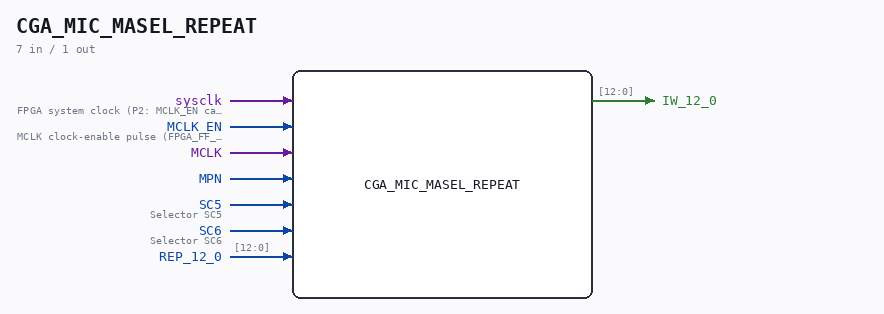

# CGA_MIC_MASEL_REPEAT

Source: `/mnt/e/Dev/Repos/Ronny/nd-120/Verilog/DELILAH-CPU/CGA_MIC/circuit/CGA_MIC_MASEL_REPEAT.v`

> Generated by `Verilog/tests/module_doc.py` from the `//!`
> comments in the source. Do not edit by hand - edit the RTL comments and regenerate.

## Description

ND120 CGA (CPU Gate Array / DELILAH)
/CGA/MIC/MASEL/REPEAT
REPEAT
Page 20
SHEET 1 of 1
Last reviewed: 1-DEC-2024
Ronny Hansen

## Ports

| Direction | Width | Name | Description |
|---|---|---|---|
| input | `1` | `sysclk` | FPGA system clock (P2: MCLK_EN capture) |
| input | `1` | `MCLK_EN` | MCLK clock-enable pulse (FPGA_FF_MODE, else 0) |
| input | `1` | `MCLK` |  |
| input | `1` | `MPN` |  |
| input | `1` | `SC5` | Selector SC5 |
| input | `1` | `SC6` | Selector SC6 |
| input | `[12:0]` | `REP_12_0` |  |
| output | `[12:0]` | `IW_12_0` |  |
