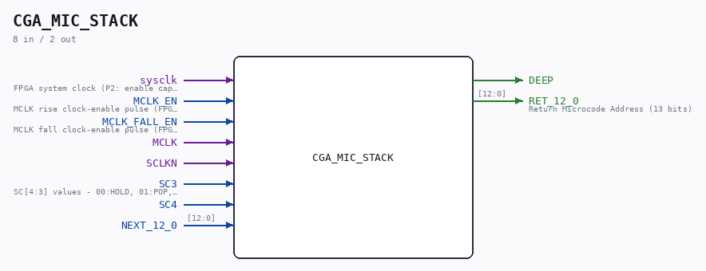

# CGA_MIC_STACK

Source: `/mnt/e/Dev/Repos/Ronny/nd-120/Verilog/DELILAH-CPU/CGA_MIC/circuit/CGA_MIC_STACK.v`

> Generated by `Verilog/tests/module_doc.py` from the `//!`
> comments in the source. Do not edit by hand - edit the RTL comments and regenerate.

## Description

ND120 CGA (CPU Gate Array / DELILAH)
/CGA/MIC/STACK
Microcode STACK
Modelled after 74S482
Page 17
SHEET 1 of 1
Last reviewed: 10-NOV-2024
Ronny Hansen

## Ports

| Direction | Width | Name | Description |
|---|---|---|---|
| input | `1` | `sysclk` | FPGA system clock (P2: enable capture) |
| input | `1` | `MCLK_EN` | MCLK rise clock-enable pulse (FPGA_FF_MODE, else 0) |
| input | `1` | `MCLK_FALL_EN` | MCLK fall clock-enable pulse (FPGA_FF_MODE, else 0) |
| input | `1` | `MCLK` |  |
| input | `1` | `SCLKN` |  |
| input | `1` | `SC3` | SC[4:3] values - 00:HOLD, 01:POP, 10:LOAD, 11:PUSH |
| input | `1` | `SC4` |  |
| input | `[12:0]` | `NEXT_12_0` |  |
| output | `1` | `DEEP` |  |
| output | `[12:0]` | `RET_12_0` | Return Microcode Address (13 bits) |
