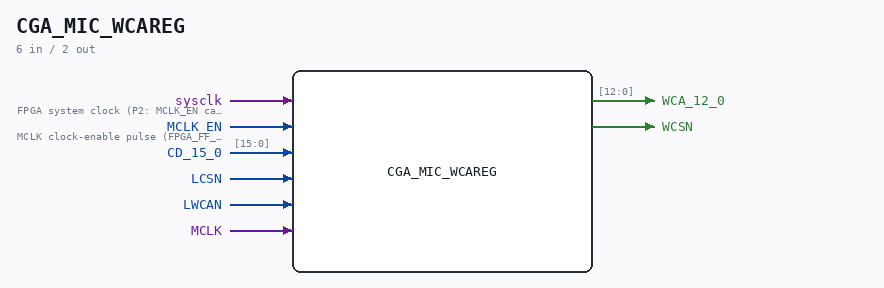

# CGA_MIC_WCAREG

Source: `/mnt/e/Dev/Repos/Ronny/nd-120/Verilog/DELILAH-CPU/CGA_MIC/circuit/CGA_MIC_WCAREG.v`

> Generated by `Verilog/tests/module_doc.py` from the `//!`
> comments in the source. Do not edit by hand - edit the RTL comments and regenerate.

## Description

ND120 CGA (CPU Gate Array / DELILAH)
/CGA/MIC/WCAREG
WCAREG
Page 21
SHEET 1 of 1
Last reviewed: 02-FEB-2025
Ronny Hansen

## Ports

| Direction | Width | Name | Description |
|---|---|---|---|
| input | `1` | `sysclk` | FPGA system clock (P2: MCLK_EN capture) |
| input | `1` | `MCLK_EN` | MCLK clock-enable pulse (FPGA_FF_MODE, else 0) |
| input | `[15:0]` | `CD_15_0` |  |
| input | `1` | `LCSN` |  |
| input | `1` | `LWCAN` |  |
| input | `1` | `MCLK` |  |
| output | `[12:0]` | `WCA_12_0` |  |
| output | `1` | `WCSN` |  |
