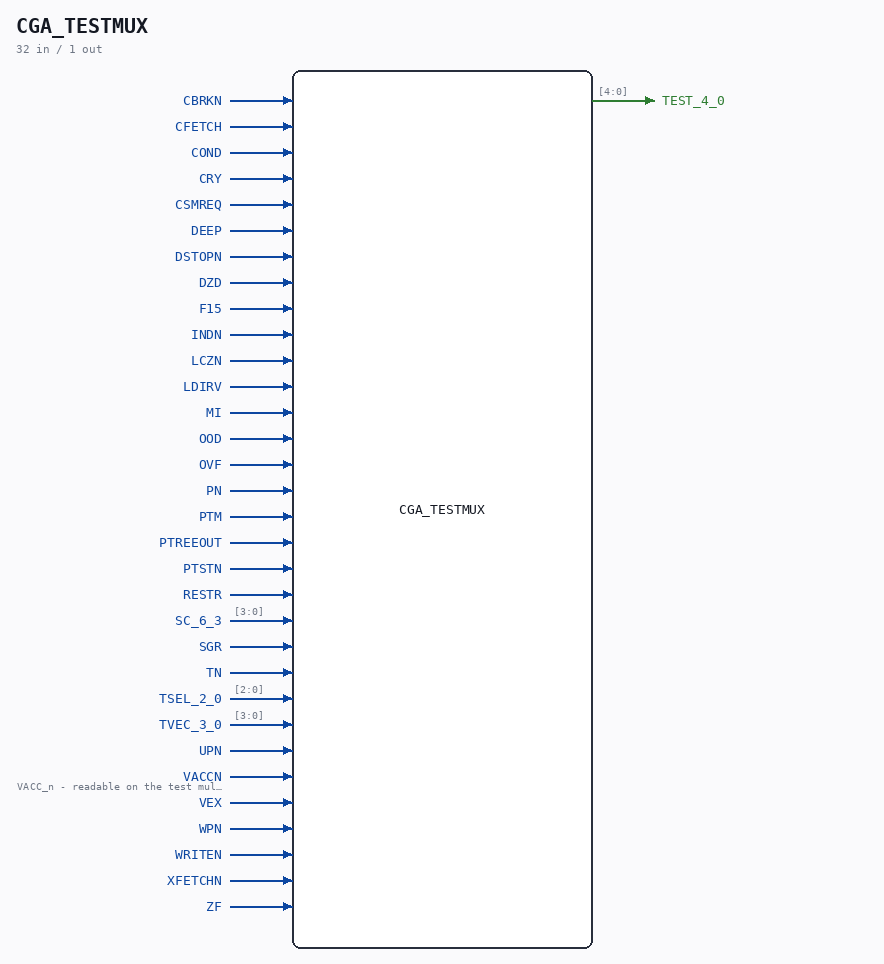

# CGA_TESTMUX

Source: `/mnt/e/Dev/Repos/Ronny/nd-120/Verilog/DELILAH-CPU/CGA_TESTMUX/circuit/CGA_TESTMUX.v`

> Generated by `Verilog/tests/module_doc.py` from the `//!`
> comments in the source. Do not edit by hand - edit the RTL comments and regenerate.

## Description

ND120 CGA (CPU Gate Array / DELILAH)
/CGA/TESTMUX
TESTMUX
Page 105
SHEET 1 of 1
Last reviewed: 10-NOV-2024
Ronny Hansen

## Ports

| Direction | Width | Name | Description |
|---|---|---|---|
| input | `1` | `CBRKN` |  |
| input | `1` | `CFETCH` |  |
| input | `1` | `COND` |  |
| input | `1` | `CRY` |  |
| input | `1` | `CSMREQ` |  |
| input | `1` | `DEEP` |  |
| input | `1` | `DSTOPN` |  |
| input | `1` | `DZD` |  |
| input | `1` | `F15` |  |
| input | `1` | `INDN` |  |
| input | `1` | `LCZN` |  |
| input | `1` | `LDIRV` |  |
| input | `1` | `MI` |  |
| input | `1` | `OOD` |  |
| input | `1` | `OVF` |  |
| input | `1` | `PN` |  |
| input | `1` | `PTM` |  |
| input | `1` | `PTREEOUT` |  |
| input | `1` | `PTSTN` |  |
| input | `1` | `RESTR` |  |
| input | `[3:0]` | `SC_6_3` |  |
| input | `1` | `SGR` |  |
| input | `1` | `TN` |  |
| input | `[2:0]` | `TSEL_2_0` |  |
| input | `[3:0]` | `TVEC_3_0` |  |
| input | `1` | `UPN` |  |
| input | `1` | `VACCN` | VACC_n - readable on the test multiplexer, D1 input |
| input | `1` | `VEX` |  |
| input | `1` | `WPN` |  |
| input | `1` | `WRITEN` |  |
| input | `1` | `XFETCHN` |  |
| input | `1` | `ZF` |  |
| output | `[4:0]` | `TEST_4_0` |  |
