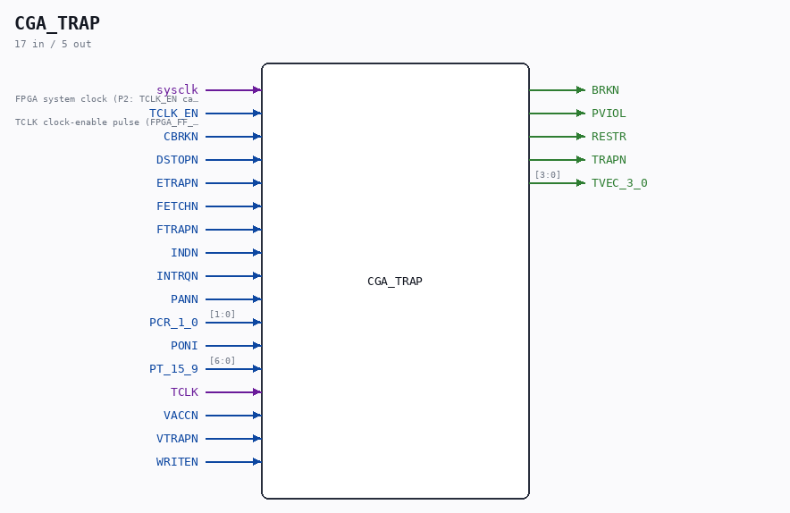

# CGA_TRAP

Source: `/mnt/e/Dev/Repos/Ronny/nd-120/Verilog/DELILAH-CPU/CGA_TRAP/circuit/CGA_TRAP.v`

> Generated by `Verilog/tests/module_doc.py` from the `//!`
> comments in the source. Do not edit by hand - edit the RTL comments and regenerate.

## Description

ND120 CGA (CPU Gate Array / DELILAH)
/CGA/TRAP
Trap
Page 100
SHEET 1 of 1
Last reviewed: 19-JAN-2025
Ronny Hansen

## Ports

| Direction | Width | Name | Description |
|---|---|---|---|
| input | `1` | `sysclk` | FPGA system clock (P2: TCLK_EN capture) |
| input | `1` | `TCLK_EN` | TCLK clock-enable pulse (FPGA_FF_MODE, else 0) |
| input | `1` | `CBRKN` |  |
| input | `1` | `DSTOPN` |  |
| input | `1` | `ETRAPN` |  |
| input | `1` | `FETCHN` |  |
| input | `1` | `FTRAPN` |  |
| input | `1` | `INDN` |  |
| input | `1` | `INTRQN` |  |
| input | `1` | `PANN` |  |
| input | `[1:0]` | `PCR_1_0` |  |
| input | `1` | `PONI` |  |
| input | `[6:0]` | `PT_15_9` |  |
| input | `1` | `TCLK` |  |
| input | `1` | `VACCN` |  |
| input | `1` | `VTRAPN` |  |
| input | `1` | `WRITEN` |  |
| output | `1` | `BRKN` |  |
| output | `1` | `PVIOL` |  |
| output | `1` | `RESTR` |  |
| output | `1` | `TRAPN` |  |
| output | `[3:0]` | `TVEC_3_0` |  |
