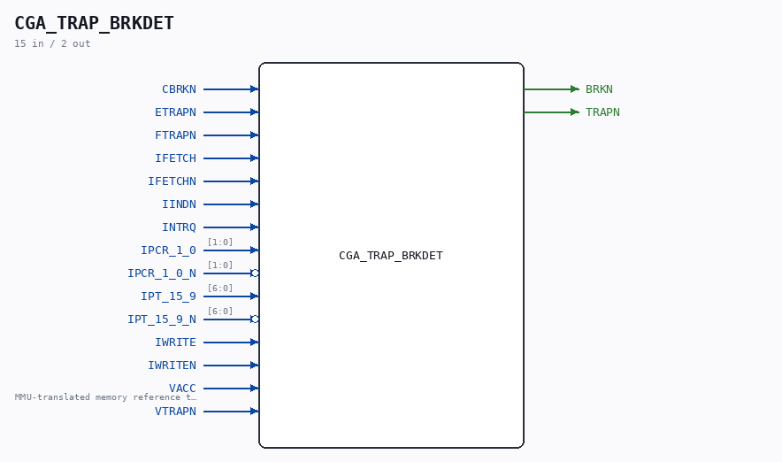

# CGA_TRAP_BRKDET

Source: `/mnt/e/Dev/Repos/Ronny/nd-120/Verilog/DELILAH-CPU/CGA_TRAP/circuit/CGA_TRAP_BRKDET.v`

> Generated by `Verilog/tests/module_doc.py` from the `//!`
> comments in the source. Do not edit by hand - edit the RTL comments and regenerate.

## Description

ND120 CGA (CPU Gate Array / DELILAH)
/CGA/TRAP/BRKDET
BREAK DETECTION (?)
Page 103
SHEET 1 of 1
Last reviewed: 2-FEB-2024
Ronny Hansen

## Ports

| Direction | Width | Name | Description |
|---|---|---|---|
| input | `1` | `CBRKN` |  |
| input | `1` | `ETRAPN` |  |
| input | `1` | `FTRAPN` |  |
| input | `1` | `IFETCH` |  |
| input | `1` | `IFETCHN` |  |
| input | `1` | `IINDN` |  |
| input | `1` | `INTRQ` |  |
| input | `[1:0]` | `IPCR_1_0` |  |
| input | `[1:0]` | `IPCR_1_0_N` *(active low)* |  |
| input | `[6:0]` | `IPT_15_9` |  |
| input | `[6:0]` | `IPT_15_9_N` *(active low)* |  |
| input | `1` | `IWRITE` |  |
| input | `1` | `IWRITEN` |  |
| input | `1` | `VACC` | MMU-translated memory reference this cycle - qualifies every break/protect term |
| input | `1` | `VTRAPN` |  |
| output | `1` | `BRKN` |  |
| output | `1` | `TRAPN` |  |
