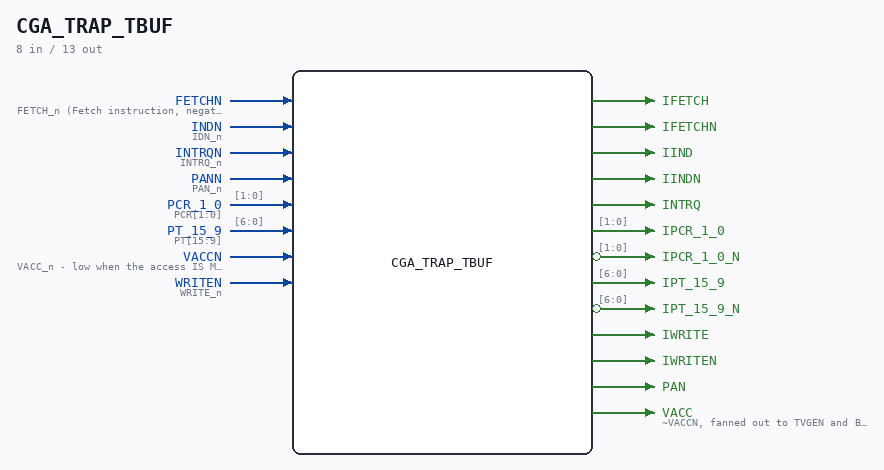

# CGA_TRAP_TBUF

Source: `/mnt/e/Dev/Repos/Ronny/nd-120/Verilog/DELILAH-CPU/CGA_TRAP/circuit/CGA_TRAP_TBUF.v`

> Generated by `Verilog/tests/module_doc.py` from the `//!`
> comments in the source. Do not edit by hand - edit the RTL comments and regenerate.

## Description

ND120 CGA (CPU Gate Array / DELILAH)
/CGA/TRAP/TBUF
TRAP BUFFERS
Page 101
SHEET 1 of 1
Last reviewed: 19-JAN-2025
Ronny Hansen

## Ports

| Direction | Width | Name | Description |
|---|---|---|---|
| input | `1` | `FETCHN` | FETCH_n (Fetch instruction, negate) |
| input | `1` | `INDN` | IDN_n |
| input | `1` | `INTRQN` | INTRQ_n |
| input | `1` | `PANN` | PAN_n |
| input | `[1:0]` | `PCR_1_0` | PCR[1:0] |
| input | `[6:0]` | `PT_15_9` | PT[15:9] |
| input | `1` | `VACCN` | VACC_n - low when the access IS MMU-translated |
| input | `1` | `WRITEN` | WRITE_n |
| output | `1` | `IFETCH` |  |
| output | `1` | `IFETCHN` |  |
| output | `1` | `IIND` |  |
| output | `1` | `IINDN` |  |
| output | `1` | `INTRQ` |  |
| output | `[1:0]` | `IPCR_1_0` |  |
| output | `[1:0]` | `IPCR_1_0_N` *(active low)* |  |
| output | `[6:0]` | `IPT_15_9` |  |
| output | `[6:0]` | `IPT_15_9_N` *(active low)* |  |
| output | `1` | `IWRITE` |  |
| output | `1` | `IWRITEN` |  |
| output | `1` | `PAN` |  |
| output | `1` | `VACC` | ~VACCN, fanned out to TVGEN and BRKDET |
