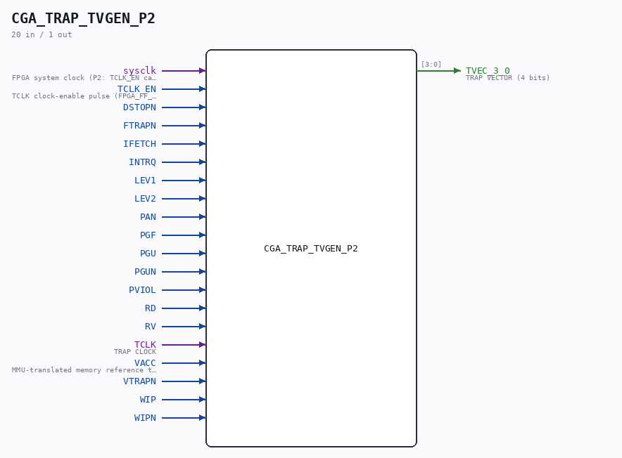

# CGA_TRAP_TVGEN_P2

Source: `/mnt/e/Dev/Repos/Ronny/nd-120/Verilog/DELILAH-CPU/CGA_TRAP/circuit/CGA_TRAP_TVGEN_P2.v`

> Generated by `Verilog/tests/module_doc.py` from the `//!`
> comments in the source. Do not edit by hand - edit the RTL comments and regenerate.

## Description

ND120 CGA (CPU Gate Array / DELILAH)
/CGA/TRAP/TVGEN/P2
P2
Page 104
SHEET 2 of 2
Last reviewed: 19-JAN-2025
Ronny Hansen

## Ports

| Direction | Width | Name | Description |
|---|---|---|---|
| input | `1` | `sysclk` | FPGA system clock (P2: TCLK_EN capture) |
| input | `1` | `TCLK_EN` | TCLK clock-enable pulse (FPGA_FF_MODE, else 0) |
| input | `1` | `DSTOPN` |  |
| input | `1` | `FTRAPN` |  |
| input | `1` | `IFETCH` |  |
| input | `1` | `INTRQ` |  |
| input | `1` | `LEV1` |  |
| input | `1` | `LEV2` |  |
| input | `1` | `PAN` |  |
| input | `1` | `PGF` |  |
| input | `1` | `PGU` |  |
| input | `1` | `PGUN` |  |
| input | `1` | `PVIOL` |  |
| input | `1` | `RD` |  |
| input | `1` | `RV` |  |
| input | `1` | `TCLK` | TRAP CLOCK |
| input | `1` | `VACC` | MMU-translated memory reference this cycle - qualifies the level-2 vector terms |
| input | `1` | `VTRAPN` |  |
| input | `1` | `WIP` |  |
| input | `1` | `WIPN` |  |
| output | `[3:0]` | `TVEC_3_0` | TRAP VECTOR (4 bits) |
