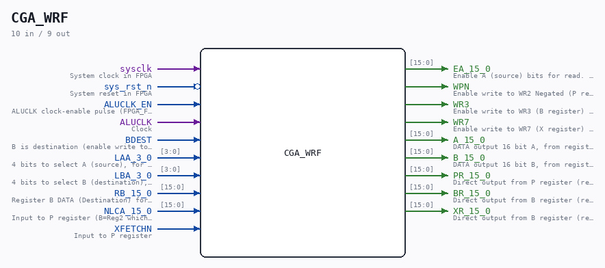

# CGA_WRF

**CPU internal 'Register File' - Read and Write operations on 16 registers**

Source: `/mnt/e/Dev/Repos/Ronny/nd-120/Verilog/DELILAH-CPU/CGA_WRF/circuit/CGA_WRF.v`
  ·  Author: Ronny Hansen

> Generated by `Verilog/tests/module_doc.py` from the `//!`
> comments in the source. Do not edit by hand - edit the RTL comments and regenerate.

## Description

ND120 CPU, MM&M
CGA/WRF
WRF: Working Register File
(PDF page 59)
Last reviewed: 9-FEB-2025
Ronny Hansen

## Ports

| Direction | Width | Name | Description |
|---|---|---|---|
| input | `1` | `sysclk` | System clock in FPGA |
| input | `1` | `sys_rst_n` *(active low)* | System reset in FPGA |
| input | `1` | `ALUCLK_EN` | ALUCLK clock-enable pulse (FPGA_FF_MODE, else 0) |
| input | `1` | `ALUCLK` | Clock |
| input | `1` | `BDEST` | B is destination (enable write to B from 'RB_15_0' on ALUCLK) |
| input | `[3:0]` | `LAA_3_0` | 4 bits to select A (source), for 16 different registers. |
| input | `[3:0]` | `LBA_3_0` | 4 bits to select B (destination), for 16 different registers. |
| input | `[15:0]` | `RB_15_0` | Register B DATA (Destination) for WRITE. 16 bits to select register(s) |
| input | `[15:0]` | `NLCA_15_0` | Input to P register (B=Reg2 which is P) |
| input | `1` | `XFETCHN` | Input to P register |
| output | `[15:0]` | `EA_15_0` | Enable A (source) bits for read. 16 bits to select register. |
| output | `1` | `WPN` | Enable write to WR2 Negated (P register) (from WR_15_0) |
| output | `1` | `WR3` | Enable write to WR3 (B register) (from WR_15_0) |
| output | `1` | `WR7` | Enable write to WR7 (X register) (from WR_15_0) |
| output | `[15:0]` | `A_15_0` | DATA output 16 bit A, from register selected by LAA_3_0 |
| output | `[15:0]` | `B_15_0` | DATA output 16 bit B, from register selected by LBA_3_0 |
| output | `[15:0]` | `PR_15_0` | Direct output from P register (register #2) |
| output | `[15:0]` | `BR_15_0` | Direct output from B register (register #3) |
| output | `[15:0]` | `XR_15_0` | Direct output from B register (register #7) |
