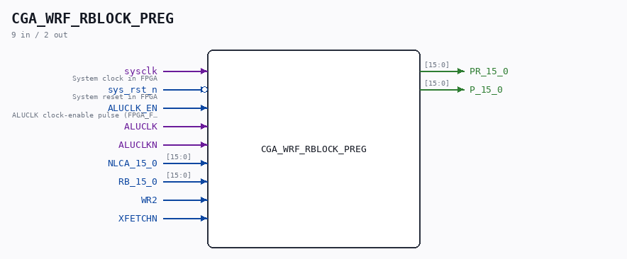

# CGA_WRF_RBLOCK_PREG

Source: `/mnt/e/Dev/Repos/Ronny/nd-120/Verilog/DELILAH-CPU/CGA_WRF/circuit/CGA_WRF_RBLOCK_PREG.v`

> Generated by `Verilog/tests/module_doc.py` from the `//!`
> comments in the source. Do not edit by hand - edit the RTL comments and regenerate.

## Description

ND120 CPU, MM&M
CGA/WRF/RBLOCK/PREG
WRF: Working Register File
(PDF page 62)
Last reviewed: 9-FEB-2025
Ronny Hansen

## Ports

| Direction | Width | Name | Description |
|---|---|---|---|
| input | `1` | `sysclk` | System clock in FPGA |
| input | `1` | `sys_rst_n` *(active low)* | System reset in FPGA |
| input | `1` | `ALUCLK_EN` | ALUCLK clock-enable pulse (FPGA_FF_MODE, else 0) |
| input | `1` | `ALUCLK` |  |
| input | `1` | `ALUCLKN` |  |
| input | `[15:0]` | `NLCA_15_0` |  |
| input | `[15:0]` | `RB_15_0` |  |
| input | `1` | `WR2` |  |
| input | `1` | `XFETCHN` |  |
| output | `[15:0]` | `PR_15_0` |  |
| output | `[15:0]` | `P_15_0` |  |
