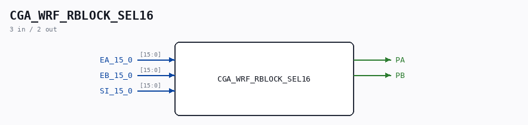

# CGA_WRF_RBLOCK_SEL16

Source: `/mnt/e/Dev/Repos/Ronny/nd-120/Verilog/DELILAH-CPU/CGA_WRF/circuit/CGA_WRF_RBLOCK_SEL16.v`

> Generated by `Verilog/tests/module_doc.py` from the `//!`
> comments in the source. Do not edit by hand - edit the RTL comments and regenerate.

## Description

ND120 CPU, MM&M
CGA/WRF/RBLOCK/SEL16
WRF: Working Register File
(PDF page 61)
Last reviewed: 09-NOV-2024
Ronny Hansen

## Ports

| Direction | Width | Name | Description |
|---|---|---|---|
| input | `[15:0]` | `EA_15_0` |  |
| input | `[15:0]` | `EB_15_0` |  |
| input | `[15:0]` | `SI_15_0` |  |
| output | `1` | `PA` |  |
| output | `1` | `PB` |  |
