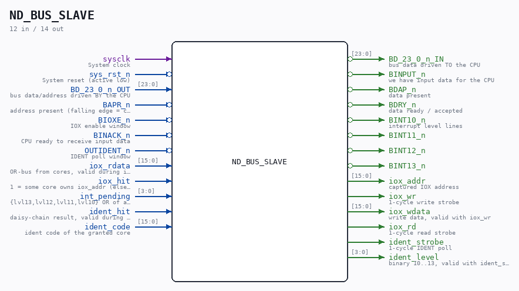

# ND_BUS_SLAVE

Source: `/mnt/e/Dev/Repos/Ronny/nd-120/Verilog/ND-BUS-DEVICES/BUS-IF/circuit/ND_BUS_SLAVE.v`

> Generated by `Verilog/tests/module_doc.py` from the `//!`
> comments in the source. Do not edit by hand - edit the RTL comments and regenerate.

## Description

ND-100 BUS SLAVE ADAPTER
The one bus adapter for all external bus devices.
Implements the device side of the ND-100 bus IOX/IDENT handshake:
BAPR/BIOXE/BINPUT/BINACK/BDAP/BDRY/OUTIDENT + BINT10-13
Ported from the C reference model simDevices/NDBus.cpp
(proccess_bif_signal), which runSim boots with today. Signal
sequence per ND-06.026.1 EN page 126.
All bus signals are active low. The BD bus is inverted: a released
bus reads all ones. Outputs drive their inactive level (1) when
idle - wired-AND with other bus agents, no z inside the FPGA.
Device-side bus: see ND-BUS-DEVICES/README.md
Last reviewed: 11-JUL-2026
Ronny Hansen

## Ports

| Direction | Width | Name | Description |
|---|---|---|---|
| input | `1` | `sysclk` | System clock |
| input | `1` | `sys_rst_n` *(active low)* | System reset (active low) |
| input | `[23:0]` | `BD_23_0_n_OUT` | bus data/address driven BY the CPU |
| output | `[23:0]` | `BD_23_0_n_IN` | bus data driven TO the CPU |
| input | `1` | `BAPR_n` *(active low)* | address present (falling edge = capture) |
| input | `1` | `BIOXE_n` *(active low)* | IOX enable window |
| input | `1` | `BINACK_n` *(active low)* | CPU ready to receive input data |
| input | `1` | `OUTIDENT_n` *(active low)* | IDENT poll window |
| output | `1` | `BINPUT_n` *(active low)* | we have input data for the CPU |
| output | `1` | `BDAP_n` *(active low)* | data present |
| output | `1` | `BDRY_n` *(active low)* | data ready / accepted |
| output | `1` | `BINT10_n` *(active low)* | interrupt level lines |
| output | `1` | `BINT11_n` *(active low)* |  |
| output | `1` | `BINT12_n` *(active low)* |  |
| output | `1` | `BINT13_n` *(active low)* |  |
| output | `[15:0]` | `iox_addr` | captured IOX address |
| output | `1` | `iox_wr` | 1-cycle write strobe |
| output | `[15:0]` | `iox_wdata` | write data, valid with iox_wr |
| output | `1` | `iox_rd` | 1-cycle read strobe |
| input | `[15:0]` | `iox_rdata` | OR-bus from cores, valid during iox_rd |
| input | `1` | `iox_hit` | 1 = some core owns iox_addr (else no answer) |
| input | `[3:0]` | `int_pending` | {lvl13,lvl12,lvl11,lvl10} OR of all cores |
| output | `1` | `ident_strobe` | 1-cycle IDENT poll |
| output | `[3:0]` | `ident_level` | binary 10..13, valid with ident_strobe |
| input | `1` | `ident_hit` | daisy-chain result, valid during strobe |
| input | `[15:0]` | `ident_code` | ident code of the granted core |
