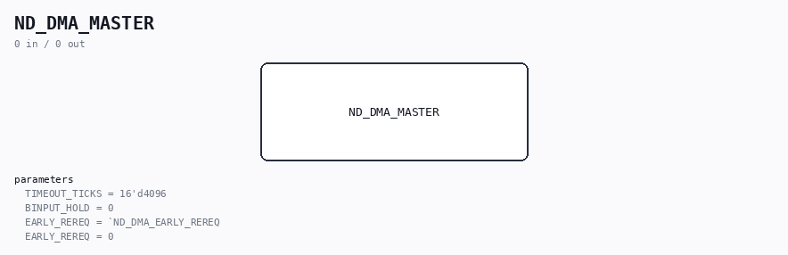

# ND_DMA_MASTER

Source: `/mnt/e/Dev/Repos/Ronny/nd-120/Verilog/ND-BUS-DEVICES/DMA/circuit/ND_DMA_MASTER.v`

> Generated by `Verilog/tests/module_doc.py` from the `//!`
> comments in the source. Do not edit by hand - edit the RTL comments and regenerate.

## Description

ND-100 DMA BUS MASTER
The request/grant + memory-reference engine every DMA controller
(floppy DMA, SMD) uses to exchange single words directly with the
NORD-100 memory system. Protocol per ND-06.016.01 chapter V and
docs/nd100-bus-dma.md:
1. Assert BREQ (wired-OR bus request) and wait.
2. The Bus Control Unit answers with BMEM (leading edge freezes
request status) and daisy-chains OUTGRANT; the first module
with a frozen request receives INGRANT and stops the token.
3. Granted: present the 24-bit physical address on BD with BAPR;
BINPUT inactive = memory read, active = memory write.
4. Read: remove the address (no feedback), assert BDAP ("BD free,
memory may drive"); memory answers data + BDRY; strobe data on
BDRY. Write: present data combined with BDAP; memory strobes on
BDAP and answers BDRY = accepted.
5. BDRY leading edge ends the grant; trailing edge releases the
bus. One word per allocation - block transfers re-request.
BDAP driver note: the master drives BDAP in BOTH directions -
verified against PAL_44902A ("PAUSE UNTIL BDAP OCCURS"), see
docs/nd100-bus-dma.md section 9 gap 1 resolution.
Daisy chain: INGRANT_n in, OUTGRANT_n out. A module that is not
requesting passes the token through; a claiming module consumes it.
All bus signals active low; BD released = all ones. Client side is a
one-word request/ack interface; the device (word counter, core
address register) sits on top and re-requests per word.
Last reviewed: 11-JUL-2026
Ronny Hansen

## Parameters

| Parameter | Default |
|---|---|
| `TIMEOUT_TICKS` | `16'd4096` |
| `BINPUT_HOLD` | `0` |
| `EARLY_REREQ` | ``ND_DMA_EARLY_REREQ` |
| `EARLY_REREQ` | `0` |
