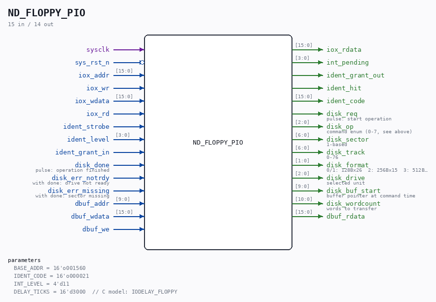

# ND_FLOPPY_PIO

Source: `/mnt/e/Dev/Repos/Ronny/nd-120/Verilog/ND-BUS-DEVICES/FLOPPY/circuit/ND_FLOPPY_PIO.v`

> Generated by `Verilog/tests/module_doc.py` from the `//!`
> comments in the source. Do not edit by hand - edit the RTL comments and regenerate.

## Description

ND-100 FLOPPY DISK CONTROLLER, PIO INTERFACE (3027 style)
Register core matching the C reference models:
Verilog/simDevices/NDDevices.cpp (class FloppyPIO)
nd100x src/devices/floppy/deviceFloppyPIO.c
Register spec: ND-11.012.01 / ND-11.015.01
IOX 1560+0 R  read data buffer (word, auto-increment pointer)
+1 W  write data buffer (word, auto-increment pointer)
+2 R  read status register 1
+3 W  write control word
+4 R  read status register 2
+5 W  write drive address (b0=1) / write difference (b0=0)
+6 R  read test data (test mode)
+7 W  write sector (b0 n/a) / write test byte (test mode)
Ident code 021 (octal), interrupt level 11.
Commands (control word b8-15, highest set bit wins):
b8 format track, b9 write data, b10 write deleted data, b11 read
ID, b12 read data, b13 seek, b14 recalibrate, b15 control reset
Completion after the disk backend finishes + DELAY_TICKS; raises
level-11 interrupt if enabled. IDENT clears pending + int enable.
The 1024-word interface buffer lives here (BRAM). The disk image is
behind the disk_* backend port: the sim harness serves an image
file, hardware serves the SDRAM-cached image with SD write-through.
NOT ported from the C models (ask before adding - documented hacks):
- RSR1 read "magic" bits 9/10/11 derived from the buffer pointer
(exists only to satisfy a diagnostic test program)
- autoload's hardcoded 388-byte boot blob (real hardware reads
track 0 sector 1; FLO-MON must be on the diskette)
- deleted-sector shadow array (no room in the image format)
Last reviewed: 11-JUL-2026
Ronny Hansen

## Parameters

| Parameter | Default |
|---|---|
| `BASE_ADDR` | `16'o001560` |
| `IDENT_CODE` | `16'o000021` |
| `INT_LEVEL` | `4'd11` |
| `DELAY_TICKS` | `16'd3000  // C model: IODELAY_FLOPPY` |

## Ports

| Direction | Width | Name | Description |
|---|---|---|---|
| input | `1` | `sysclk` |  |
| input | `1` | `sys_rst_n` *(active low)* |  |
| input | `[15:0]` | `iox_addr` |  |
| input | `1` | `iox_wr` |  |
| input | `[15:0]` | `iox_wdata` |  |
| input | `1` | `iox_rd` |  |
| output | `[15:0]` | `iox_rdata` |  |
| output | `[3:0]` | `int_pending` |  |
| input | `1` | `ident_strobe` |  |
| input | `[3:0]` | `ident_level` |  |
| input | `1` | `ident_grant_in` |  |
| output | `1` | `ident_grant_out` |  |
| output | `1` | `ident_hit` |  |
| output | `[15:0]` | `ident_code` |  |
| output | `1` | `disk_req` | pulse: start operation |
| output | `[2:0]` | `disk_op` | command enum (0-7, see above) |
| output | `[6:0]` | `disk_sector` | 1-based |
| output | `[6:0]` | `disk_track` | 0-76 |
| output | `[1:0]` | `disk_format` | 0/1: 128Bx26  2: 256Bx15  3: 512Bx8 |
| output | `[2:0]` | `disk_drive` | selected unit |
| output | `[9:0]` | `disk_buf_start` | buffer pointer at command time |
| output | `[10:0]` | `disk_wordcount` | words to transfer |
| input | `1` | `disk_done` | pulse: operation finished |
| input | `1` | `disk_err_notrdy` | with done: drive not ready |
| input | `1` | `disk_err_missing` | with done: sector missing |
| input | `[9:0]` | `dbuf_addr` |  |
| input | `[15:0]` | `dbuf_wdata` |  |
| input | `1` | `dbuf_we` |  |
| output | `[15:0]` | `dbuf_rdata` |  |
