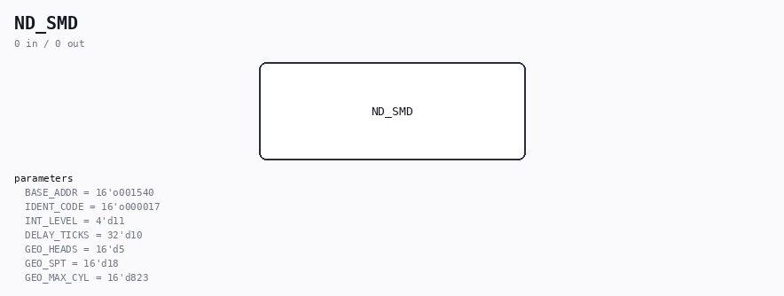

# ND_SMD

Source: `/mnt/e/Dev/Repos/Ronny/nd-120/Verilog/ND-BUS-DEVICES/SMD/circuit/ND_SMD.v`

> Generated by `Verilog/tests/module_doc.py` from the `//!`
> comments in the source. Do not edit by hand - edit the RTL comments and regenerate.

## Parameters

| Parameter | Default |
|---|---|
| `BASE_ADDR` | `16'o001540` |
| `IDENT_CODE` | `16'o000017` |
| `INT_LEVEL` | `4'd11` |
| `DELAY_TICKS` | `32'd10` |
| `GEO_HEADS` | `16'd5` |
| `GEO_SPT` | `16'd18` |
| `GEO_MAX_CYL` | `16'd823` |
