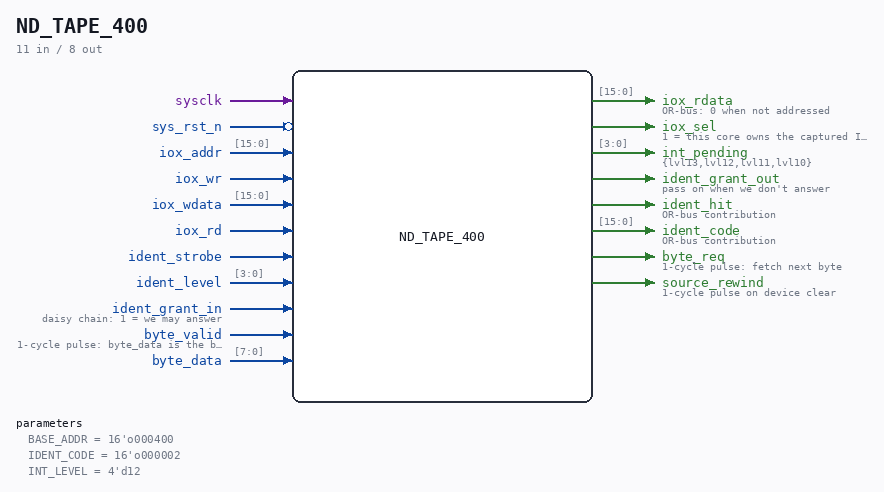

# ND_TAPE_400

Source: `/mnt/e/Dev/Repos/Ronny/nd-120/Verilog/ND-BUS-DEVICES/TAPE-400/circuit/ND_TAPE_400.v`

> Generated by `Verilog/tests/module_doc.py` from the `//!`
> comments in the source. Do not edit by hand - edit the RTL comments and regenerate.

## Description

ND-100 PAPERTAPE READER, DEVICE 400 (octal)
Register core matching the C reference model in
simDevices/NDDevices.cpp (class PaperTape), which runSim boots
with today:
IOX 400  read data      returns the character buffer, clears RFT
IOX 401  write data     (papertape WRITER only - ignored)
IOX 402  read status    bit0 = interrupt enabled
bit2 = read active
bit3 = ready for transfer (RFT)
IOX 403  write control  bit0 = interrupt enable
bit2 = activate (fetch next byte)
bit3 = ready for transfer preset
bit4 = device clear
Ident code 02 (octal), interrupt level 12.
Interrupt pending = interruptEnabled AND readyForTransfer.
IDENT on level 12 with pending interrupt returns the ident code and
clears BOTH the pending flag and the interrupt-enable bit.
The byte source is a port: the sim testbench serves a file image,
the hardware serves an SD-FAT stream. The C model fetches a byte
instantly on activate; here RFT rises when byte_valid arrives, which
the polling loader tolerates by design (it polls status bit 3).
==== WHY THIS CARD REPORTS NO STORAGE ERROR ==========================
The other three ND storage controllers in this tree map an SD-FAT
failure reason (Verilog/SD-FAT/circuit/nd_storage_status.vh) onto a
status bit or error code their own manual defines:
ND_WINCHESTER  status +4 bits b6/b7/b8/b9  (ND-11.015.01 sec 3.5)
ND_SMD         status bits b5/b6/b7/b8/b10 (ND-11.020.01 sec 2.5)
ND_FLOPPY_DMA  Status Word 1 b9-14 error code, oct 16/20 and 5
(ND-11.021.01 sec 3.4/3.9)
THIS card has nowhere to put one. Its whole interface is the four
registers above: the status word (402) carries interrupt-enabled,
read-active and ready-for-transfer, and nothing else - there is no
error bit and no error code anywhere in the device. A real ND-100
paper tape reader physically cannot say "the medium is faulty"; it
simply never becomes ready. Adding a bit here would be inventing a
register the card does not have, which the rule in
nd_storage_status.vh forbids.
So the behaviour the guest sees is unchanged and correct: on any
storage failure the source stops answering byte_req, RFT stays low,
and the loader waits exactly as it would at the end of the tape.
The REASON is published one level down instead, on the sticky
diagnostic pair nd_storage_tape_adapter.fault / .fault_code, brought
out of nd_storage_devices as TDISK_FAULT / TDISK_ERR_CODE. No ND
logic reads those - they exist for a testbench, a probe or a board
LED. Without them "the SD card fell out" and "you reached the end of
the tape" are the same observation from every point in the design.
Last reviewed: 11-JUL-2026
Ronny Hansen

## Parameters

| Parameter | Default |
|---|---|
| `BASE_ADDR` | `16'o000400` |
| `IDENT_CODE` | `16'o000002` |
| `INT_LEVEL` | `4'd12` |

## Ports

| Direction | Width | Name | Description |
|---|---|---|---|
| input | `1` | `sysclk` |  |
| input | `1` | `sys_rst_n` *(active low)* |  |
| input | `[15:0]` | `iox_addr` |  |
| input | `1` | `iox_wr` |  |
| input | `[15:0]` | `iox_wdata` |  |
| input | `1` | `iox_rd` |  |
| output | `[15:0]` | `iox_rdata` | OR-bus: 0 when not addressed |
| output | `1` | `iox_sel` | 1 = this core owns the captured IOX address |
| output | `[3:0]` | `int_pending` | {lvl13,lvl12,lvl11,lvl10} |
| input | `1` | `ident_strobe` |  |
| input | `[3:0]` | `ident_level` |  |
| input | `1` | `ident_grant_in` | daisy chain: 1 = we may answer |
| output | `1` | `ident_grant_out` | pass on when we don't answer |
| output | `1` | `ident_hit` | OR-bus contribution |
| output | `[15:0]` | `ident_code` | OR-bus contribution |
| output | `1` | `byte_req` | 1-cycle pulse: fetch next byte |
| input | `1` | `byte_valid` | 1-cycle pulse: byte_data is the byte |
| input | `[7:0]` | `byte_data` |  |
| output | `1` | `source_rewind` | 1-cycle pulse on device clear |
