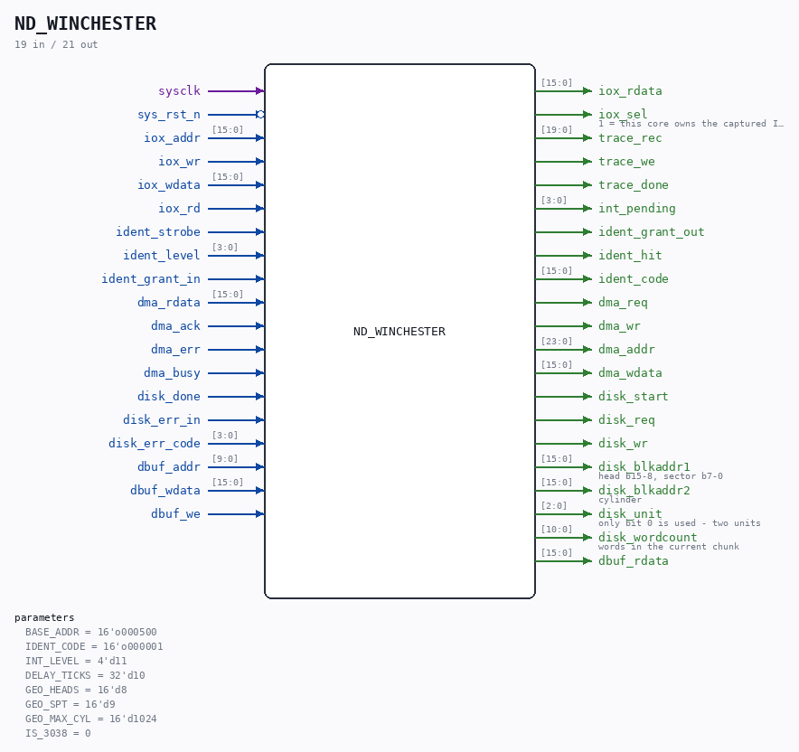

# ND_WINCHESTER

Source: `/mnt/e/Dev/Repos/Ronny/nd-120/Verilog/ND-BUS-DEVICES/WINCHESTER/circuit/ND_WINCHESTER.v`

> Generated by `Verilog/tests/module_doc.py` from the `//!`
> comments in the source. Do not edit by hand - edit the RTL comments and regenerate.

## Parameters

| Parameter | Default |
|---|---|
| `BASE_ADDR` | `16'o000500` |
| `IDENT_CODE` | `16'o000001` |
| `INT_LEVEL` | `4'd11` |
| `DELAY_TICKS` | `32'd10` |
| `GEO_HEADS` | `16'd8` |
| `GEO_SPT` | `16'd9` |
| `GEO_MAX_CYL` | `16'd1024` |
| `IS_3038` | `0` |

## Ports

| Direction | Width | Name | Description |
|---|---|---|---|
| input | `1` | `sysclk` |  |
| input | `1` | `sys_rst_n` *(active low)* |  |
| input | `[15:0]` | `iox_addr` |  |
| input | `1` | `iox_wr` |  |
| input | `[15:0]` | `iox_wdata` |  |
| input | `1` | `iox_rd` |  |
| output | `[15:0]` | `iox_rdata` |  |
| output | `1` | `iox_sel` | 1 = this core owns the captured IOX address |
| output | `[19:0]` | `trace_rec` |  |
| output | `1` | `trace_we` |  |
| output | `1` | `trace_done` |  |
| output | `[3:0]` | `int_pending` |  |
| input | `1` | `ident_strobe` |  |
| input | `[3:0]` | `ident_level` |  |
| input | `1` | `ident_grant_in` |  |
| output | `1` | `ident_grant_out` |  |
| output | `1` | `ident_hit` |  |
| output | `[15:0]` | `ident_code` |  |
| output | `1` | `dma_req` |  |
| output | `1` | `dma_wr` |  |
| output | `[23:0]` | `dma_addr` |  |
| output | `[15:0]` | `dma_wdata` |  |
| input | `[15:0]` | `dma_rdata` |  |
| input | `1` | `dma_ack` |  |
| input | `1` | `dma_err` |  |
| input | `1` | `dma_busy` |  |
| output | `1` | `disk_start` |  |
| output | `1` | `disk_req` |  |
| output | `1` | `disk_wr` |  |
| output | `[15:0]` | `disk_blkaddr1` | head b15-8, sector b7-0 |
| output | `[15:0]` | `disk_blkaddr2` | cylinder |
| output | `[2:0]` | `disk_unit` | only bit 0 is used - two units |
| output | `[10:0]` | `disk_wordcount` | words in the current chunk |
| input | `1` | `disk_done` |  |
| input | `1` | `disk_err_in` |  |
| input | `[3:0]` | `disk_err_code` |  |
| input | `[9:0]` | `dbuf_addr` |  |
| input | `[15:0]` | `dbuf_wdata` |  |
| input | `1` | `dbuf_we` |  |
| output | `[15:0]` | `dbuf_rdata` |  |
