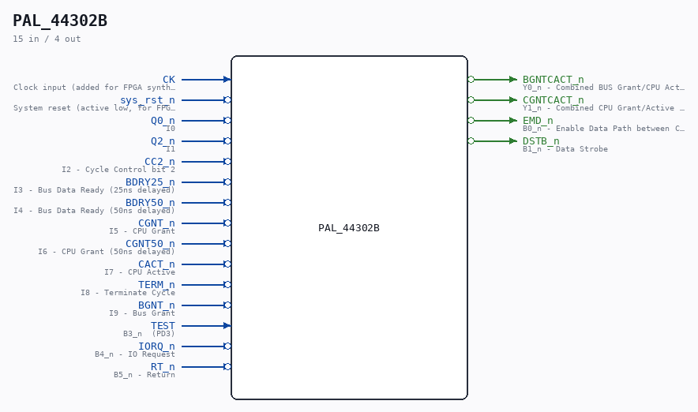

# PAL_44302B

Source: `/mnt/e/Dev/Repos/Ronny/nd-120/Verilog/PAL/PAL_44302B.v`

> Generated by `Verilog/tests/module_doc.py` from the `//!`
> comments in the source. Do not edit by hand - edit the RTL comments and regenerate.

## Description

ND120 PALASM CODE CONVERTED TO VERILOG
Component PAL 44302B
Last reviewed: 14-DEC-2024
Ronny Hansen

## Ports

| Direction | Width | Name | Description |
|---|---|---|---|
| input | `1` | `CK` | Clock input (added for FPGA synthesis) |
| input | `1` | `sys_rst_n` *(active low)* | System reset (active low, for FPGA synthesis) |
| input | `1` | `Q0_n` *(active low)* | I0 |
| input | `1` | `Q2_n` *(active low)* | I1 |
| input | `1` | `CC2_n` *(active low)* | I2 - Cycle Control bit 2 |
| input | `1` | `BDRY25_n` *(active low)* | I3 - Bus Data Ready (25ns delayed) |
| input | `1` | `BDRY50_n` *(active low)* | I4 - Bus Data Ready (50ns delayed) |
| input | `1` | `CGNT_n` *(active low)* | I5 - CPU Grant |
| input | `1` | `CGNT50_n` *(active low)* | I6 - CPU Grant (50ns delayed) |
| input | `1` | `CACT_n` *(active low)* | I7 - CPU Active |
| input | `1` | `TERM_n` *(active low)* | I8 - Terminate Cycle |
| input | `1` | `BGNT_n` *(active low)* | I9 - Bus Grant |
| output | `1` | `BGNTCACT_n` *(active low)* | Y0_n - Combined BUS Grant/CPU Active signal |
| output | `1` | `CGNTCACT_n` *(active low)* | Y1_n - Combined CPU Grant/Active signal |
| output | `1` | `EMD_n` *(active low)* | B0_n - Enable Data Path between CD and LBD |
| output | `1` | `DSTB_n` *(active low)* | B1_n - Data Strobe |
| input | `1` | `TEST` | B3_n  (PD3) |
| input | `1` | `IORQ_n` *(active low)* | B4_n - IO Request |
| input | `1` | `RT_n` *(active low)* | B5_n - Return |
