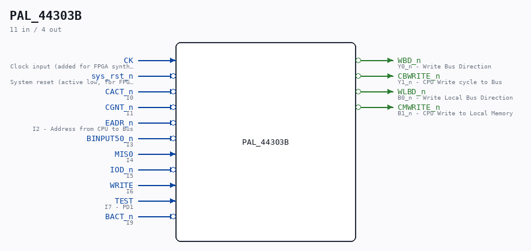

# PAL_44303B

Source: `/mnt/e/Dev/Repos/Ronny/nd-120/Verilog/PAL/PAL_44303B.v`

> Generated by `Verilog/tests/module_doc.py` from the `//!`
> comments in the source. Do not edit by hand - edit the RTL comments and regenerate.

## Description

ND120 PALASM CODE CONVERTED TO VERILOG
Component PAL 44303B
Last reviewed: 2-FEB-2025
Ronny Hansen

## Ports

| Direction | Width | Name | Description |
|---|---|---|---|
| input | `1` | `CK` | Clock input (added for FPGA synthesis) |
| input | `1` | `sys_rst_n` *(active low)* | System reset (active low, for FPGA synthesis) |
| input | `1` | `CACT_n` *(active low)* | I0 |
| input | `1` | `CGNT_n` *(active low)* | I1 |
| input | `1` | `EADR_n` *(active low)* | I2 - Address from CPU to Bus |
| input | `1` | `BINPUT50_n` *(active low)* | I3 |
| input | `1` | `MIS0` | I4 |
| input | `1` | `IOD_n` *(active low)* | I5 |
| input | `1` | `WRITE` | I6 |
| input | `1` | `TEST` | I7 - PD1 |
| input | `1` | `BACT_n` *(active low)* | I9 |
| output | `1` | `WBD_n` *(active low)* | Y0_n - Write Bus Direction |
| output | `1` | `CBWRITE_n` *(active low)* | Y1_n - CPU Write cycle to Bus |
| output | `1` | `WLBD_n` *(active low)* | B0_n - Write Local Bus Direction |
| output | `1` | `CMWRITE_n` *(active low)* | B1_n - CPU Write to Local Memory |
