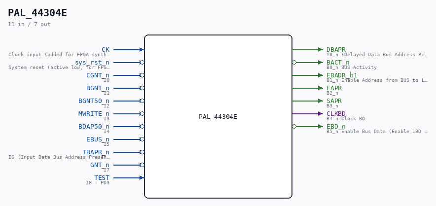

# PAL_44304E

Source: `/mnt/e/Dev/Repos/Ronny/nd-120/Verilog/PAL/PAL_44304E.v`

> Generated by `Verilog/tests/module_doc.py` from the `//!`
> comments in the source. Do not edit by hand - edit the RTL comments and regenerate.

## Description

ND120 PALASM CODE CONVERTED TO VERILOG
Component PAL 44304E
Last reviewed: 22-MAR-2025
Ronny Hansen

## Ports

| Direction | Width | Name | Description |
|---|---|---|---|
| input | `1` | `CK` | Clock input (added for FPGA synthesis) |
| input | `1` | `sys_rst_n` *(active low)* | System reset (active low, for FPGA synthesis) |
| input | `1` | `CGNT_n` *(active low)* | I0 |
| input | `1` | `BGNT_n` *(active low)* | I1 |
| input | `1` | `BGNT50_n` *(active low)* | I2 |
| input | `1` | `MWRITE_n` *(active low)* | I3 |
| input | `1` | `BDAP50_n` *(active low)* | I4 |
| input | `1` | `EBUS_n` *(active low)* | I5 |
| input | `1` | `IBAPR_n` *(active low)* | I6 (Input Data Bus Address Present) |
| input | `1` | `GNT_n` *(active low)* | I7 |
| input | `1` | `TEST` | I8 - PD3 |
| output | `1` | `DBAPR` | Y0_n (Delayed Data Bus Address Present) |
| output | `1` | `BACT_n` *(active low)* | B0_n BUS Activity |
| output | `1` | `EBADR_b1` | B1_n Enable Address from BUS to Local Memory |
| output | `1` | `FAPR` | B2_n |
| output | `1` | `SAPR` | B3_n |
| output | `1` | `CLKBD` | B4_n Clock BD |
| output | `1` | `EBD_n` *(active low)* | B5_n Enable Bus Data (Enable LBD to BD transceiver) |
