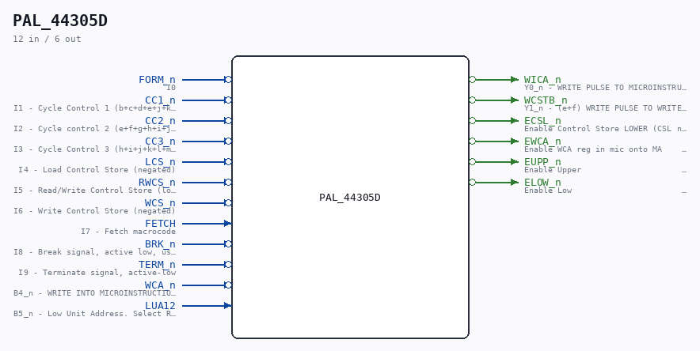

# PAL_44305D

Source: `/mnt/e/Dev/Repos/Ronny/nd-120/Verilog/PAL/PAL_44305D.v`

> Generated by `Verilog/tests/module_doc.py` from the `//!`
> comments in the source. Do not edit by hand - edit the RTL comments and regenerate.

## Description

ND120 PALASM CODE CONVERTED TO VERILOG
Component PAL 44305D
Last reviewed: 2-FEB-2025
Ronny Hansen

## Ports

| Direction | Width | Name | Description |
|---|---|---|---|
| input | `1` | `FORM_n` *(active low)* | I0 |
| input | `1` | `CC1_n` *(active low)* | I1 - Cycle Control 1 (b+c+d+e+j+k+l+m) |
| input | `1` | `CC2_n` *(active low)* | I2 - Cycle control 2 (e+f+g+h+i+j+k) |
| input | `1` | `CC3_n` *(active low)* | I3 - Cycle Control 3 (h+i+j+k+l+m+n+o) |
| input | `1` | `LCS_n` *(active low)* | I4 - Load Control Store (negated) |
| input | `1` | `RWCS_n` *(active low)* | I5 - Read/Write Control Store (low=write) |
| input | `1` | `WCS_n` *(active low)* | I6 - Write Control Store (negated) |
| input | `1` | `FETCH` | I7 - Fetch macrocode |
| input | `1` | `BRK_n` *(active low)* | I8 - Break signal, active low, used to interrupt normal operation for debugging or error handling. |
| input | `1` | `TERM_n` *(active low)* | I9 - Terminate signal, active-low |
| output | `1` | `WICA_n` *(active low)* | Y0_n - WRITE PULSE TO MICROINSTRUCTION CACHE |
| output | `1` | `WCSTB_n` *(active low)* | Y1_n - (e+f) WRITE PULSE TO WRITEABLE | (m+n) WRITE PULSE DURING LOAD CONTROL |
| output | `1` | `ECSL_n` *(active low)* | Enable Control Store LOWER (CSL negated)  B0_n - READ CONTROL STORE HOLD | HOLD OVERLAP WITH EWCA_n |
| output | `1` | `EWCA_n` *(active low)* | Enable WCA reg in mic onto MA       B1_n - ENABLE WCA REG. IN MIC ONTO MA |  AVOID BLIP ON NEXT CYCLE |
| output | `1` | `EUPP_n` *(active low)* | Enable Upper                        B2_n - NORMAL ADDRESSING | WRITE INTO MICROINSTRUCTION CACHE | ENABLE IN THE FIRST 50NS |
| output | `1` | `ELOW_n` *(active low)* | Enable Low                          B3_n - NORMAL ADDRESSING. ON FETCH EITHER MI |  ENABLE ACCORDING TO LUA12 BEFORE FETCH | OR A MAP IS USED. |  DO A MAP | ON BRK: USE BANK SELECTED BY LUA12. |
| input | `1` | `WCA_n` *(active low)* | B4_n - WRITE INTO MICROINSTRUCTION CACHE (negated) |
| input | `1` | `LUA12` | B5_n - Low Unit Address. Select RAM bank (0=lower,1=upper) |
