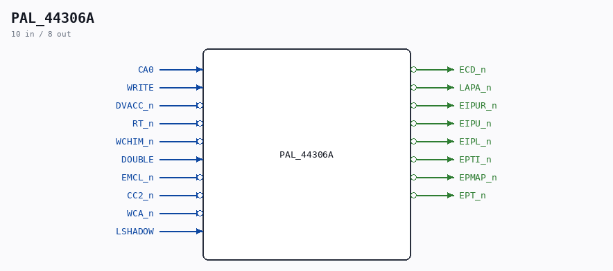

# PAL_44306A

Source: `/mnt/e/Dev/Repos/Ronny/nd-120/Verilog/PAL/PAL_44306A.v`

> Generated by `Verilog/tests/module_doc.py` from the `//!`
> comments in the source. Do not edit by hand - edit the RTL comments and regenerate.

## Description

ND120 PALASM CODE CONVERTED TO VERILOG
Component PAL 44306A
Last reviewed: 19-JAN-2025
Ronny Hansen

## Ports

| Direction | Width | Name | Description |
|---|---|---|---|
| input | `1` | `CA0` |  |
| input | `1` | `WRITE` |  |
| input | `1` | `DVACC_n` *(active low)* |  |
| input | `1` | `RT_n` *(active low)* |  |
| input | `1` | `WCHIM_n` *(active low)* |  |
| input | `1` | `DOUBLE` |  |
| input | `1` | `EMCL_n` *(active low)* |  |
| input | `1` | `CC2_n` *(active low)* |  |
| input | `1` | `WCA_n` *(active low)* |  |
| input | `1` | `LSHADOW` |  |
| output | `1` | `ECD_n` *(active low)* |  |
| output | `1` | `LAPA_n` *(active low)* |  |
| output | `1` | `EIPUR_n` *(active low)* |  |
| output | `1` | `EIPU_n` *(active low)* |  |
| output | `1` | `EIPL_n` *(active low)* |  |
| output | `1` | `EPTI_n` *(active low)* |  |
| output | `1` | `EPMAP_n` *(active low)* |  |
| output | `1` | `EPT_n` *(active low)* |  |
