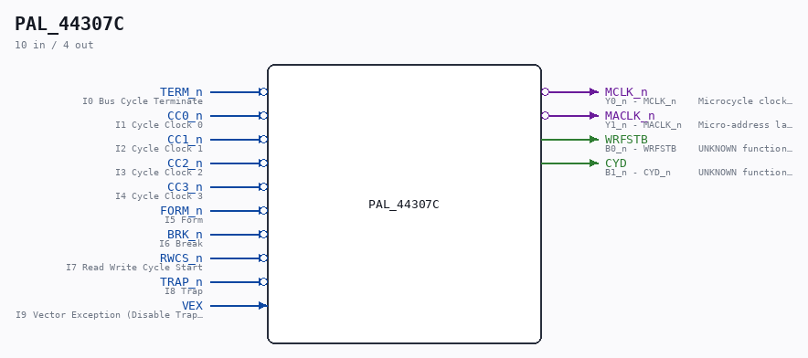

# PAL_44307C

Source: `/mnt/e/Dev/Repos/Ronny/nd-120/Verilog/PAL/PAL_44307C.v`

> Generated by `Verilog/tests/module_doc.py` from the `//!`
> comments in the source. Do not edit by hand - edit the RTL comments and regenerate.

## Description

ND120 PALASM CODE CONVERTED TO VERILOG
Component PAL 44307C
Last reviewed: 22-MAR-2025
Ronny Hansen

## Ports

| Direction | Width | Name | Description |
|---|---|---|---|
| input | `1` | `TERM_n` *(active low)* | I0 Bus Cycle Terminate |
| input | `1` | `CC0_n` *(active low)* | I1 Cycle Clock 0 |
| input | `1` | `CC1_n` *(active low)* | I2 Cycle Clock 1 |
| input | `1` | `CC2_n` *(active low)* | I3 Cycle Clock 2 |
| input | `1` | `CC3_n` *(active low)* | I4 Cycle Clock 3 |
| input | `1` | `FORM_n` *(active low)* | I5 Form |
| input | `1` | `BRK_n` *(active low)* | I6 Break |
| input | `1` | `RWCS_n` *(active low)* | I7 Read Write Cycle Start |
| input | `1` | `TRAP_n` *(active low)* | I8 Trap |
| input | `1` | `VEX` | I9 Vector Exception (Disable Traps) |
| output | `1` | `MCLK_n` *(active low)* | Y0_n - MCLK_n    Microcycle clock (negated). = TERM outside RWCS; stretched during RWCS. |
| output | `1` | `MACLK_n` *(active low)* | Y1_n - MACLK_n   Micro-address latch strobe (negated). Latch enable for the control-store address latches (ACAL). |
| output | `1` | `WRFSTB` | B0_n - WRFSTB    UNKNOWN function. Fires in state 0001 of most cycle kinds. |
| output | `1` | `CYD` | B1_n - CYD_n     UNKNOWN function. Listing comment: "WRITE PULSE USED IN WMAP AND WCA" (the memory map and the microinstruction cache |
