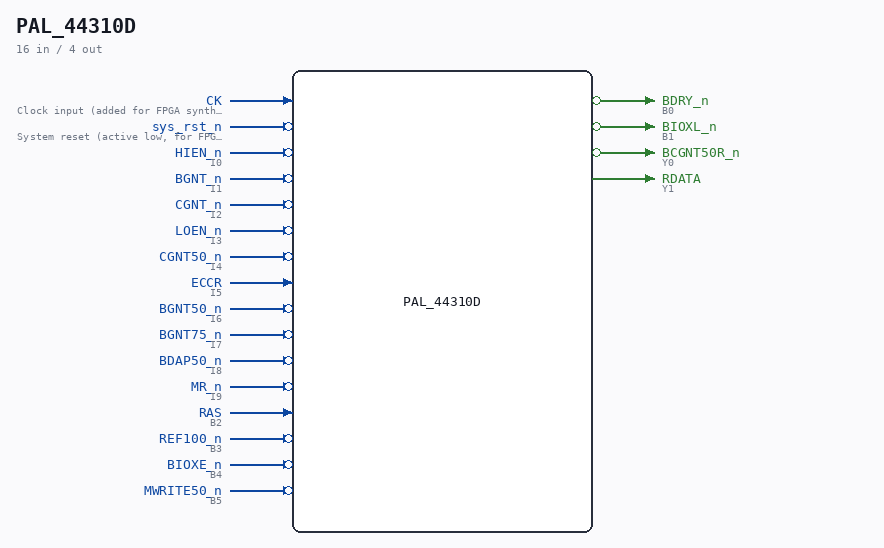

# PAL_44310D

Source: `/mnt/e/Dev/Repos/Ronny/nd-120/Verilog/PAL/PAL_44310D.v`

> Generated by `Verilog/tests/module_doc.py` from the `//!`
> comments in the source. Do not edit by hand - edit the RTL comments and regenerate.

## Description

ND120 PALASM CODE CONVERTED TO VERILOG
Component PAL 44310D
Last reviewed: 2-FEB-2025
Ronny Hansen

## Ports

| Direction | Width | Name | Description |
|---|---|---|---|
| input | `1` | `CK` | Clock input (added for FPGA synthesis) |
| input | `1` | `sys_rst_n` *(active low)* | System reset (active low, for FPGA synthesis) |
| input | `1` | `HIEN_n` *(active low)* | I0 |
| input | `1` | `BGNT_n` *(active low)* | I1 |
| input | `1` | `CGNT_n` *(active low)* | I2 |
| input | `1` | `LOEN_n` *(active low)* | I3 |
| input | `1` | `CGNT50_n` *(active low)* | I4 |
| input | `1` | `ECCR` | I5 |
| input | `1` | `BGNT50_n` *(active low)* | I6 |
| input | `1` | `BGNT75_n` *(active low)* | I7 |
| input | `1` | `BDAP50_n` *(active low)* | I8 |
| input | `1` | `MR_n` *(active low)* | I9 |
| output | `1` | `BDRY_n` *(active low)* | B0 |
| output | `1` | `BIOXL_n` *(active low)* | B1 |
| input | `1` | `RAS` | B2 |
| input | `1` | `REF100_n` *(active low)* | B3 |
| input | `1` | `BIOXE_n` *(active low)* | B4 |
| input | `1` | `MWRITE50_n` *(active low)* | B5 |
| output | `1` | `BCGNT50R_n` *(active low)* | Y0 |
| output | `1` | `RDATA` | Y1 |
