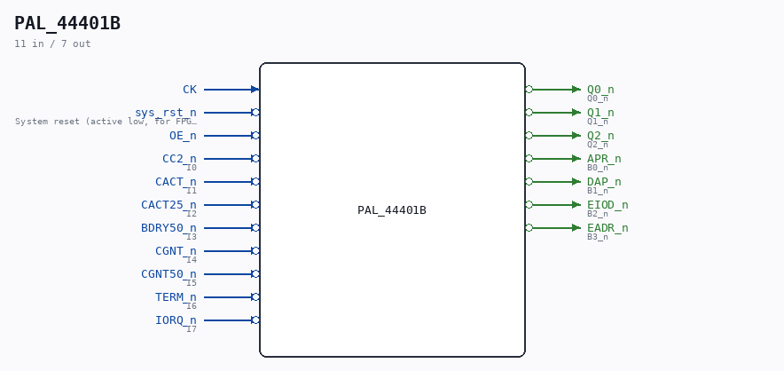

# PAL_44401B

Source: `/mnt/e/Dev/Repos/Ronny/nd-120/Verilog/PAL/PAL_44401B.v`

> Generated by `Verilog/tests/module_doc.py` from the `//!`
> comments in the source. Do not edit by hand - edit the RTL comments and regenerate.

## Description

ND120 PALASM CODE CONVERTED TO VERILOG
Component PAL 44401B
Last reviewed: 2-FEB-2025
Ronny Hansen

## Ports

| Direction | Width | Name | Description |
|---|---|---|---|
| input | `1` | `CK` |  |
| input | `1` | `sys_rst_n` *(active low)* | System reset (active low, for FPGA synthesis) |
| input | `1` | `OE_n` *(active low)* |  |
| input | `1` | `CC2_n` *(active low)* | I0 |
| input | `1` | `CACT_n` *(active low)* | I1 |
| input | `1` | `CACT25_n` *(active low)* | I2 |
| input | `1` | `BDRY50_n` *(active low)* | I3 |
| input | `1` | `CGNT_n` *(active low)* | I4 |
| input | `1` | `CGNT50_n` *(active low)* | I5 |
| input | `1` | `TERM_n` *(active low)* | I6 |
| input | `1` | `IORQ_n` *(active low)* | I7 |
| output | `1` | `Q0_n` *(active low)* | Q0_n |
| output | `1` | `Q1_n` *(active low)* | Q1_n |
| output | `1` | `Q2_n` *(active low)* | Q2_n |
| output | `1` | `APR_n` *(active low)* | B0_n |
| output | `1` | `DAP_n` *(active low)* | B1_n |
| output | `1` | `EIOD_n` *(active low)* | B2_n |
| output | `1` | `EADR_n` *(active low)* | B3_n |
