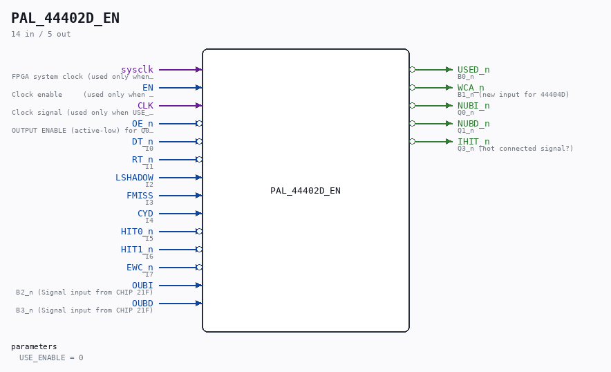

# PAL_44402D_EN

Source: `/mnt/e/Dev/Repos/Ronny/nd-120/Verilog/PAL/PAL_44402D_EN.v`

> Generated by `Verilog/tests/module_doc.py` from the `//!`
> comments in the source. Do not edit by hand - edit the RTL comments and regenerate.

## Description

ND120 PALASM CODE CONVERTED TO VERILOG
Component PAL 44402D - clock-enable variant
Equation copy of PAL_44402D.v (which stays untouched) with an optional
sysclk+enable capture mode for the four registered outputs.
USE_ENABLE=0 (default): instantiates the original PAL_44402D - posedge
CLK, original behaviour.
USE_ENABLE=1: the registers capture on posedge sysclk when EN is high
(P3 UCLK-domain conversion mode, docs/plan-fix-unconstrained-clocks.md).
EN must be the rise-aligned UCLK enable (CYC_36 UCLK_EN).
Last reviewed: 10-JUL-2026
Ronny Hansen

## Parameters

| Parameter | Default |
|---|---|
| `USE_ENABLE` | `0` |

## Ports

| Direction | Width | Name | Description |
|---|---|---|---|
| input | `1` | `sysclk` | FPGA system clock (used only when USE_ENABLE=1) |
| input | `1` | `EN` | Clock enable     (used only when USE_ENABLE=1) |
| input | `1` | `CLK` | Clock signal (used only when USE_ENABLE=0) |
| input | `1` | `OE_n` *(active low)* | OUTPUT ENABLE (active-low) for Q0-Q3 |
| input | `1` | `DT_n` *(active low)* | I0 |
| input | `1` | `RT_n` *(active low)* | I1 |
| input | `1` | `LSHADOW` | I2 |
| input | `1` | `FMISS` | I3 |
| input | `1` | `CYD` | I4 |
| input | `1` | `HIT0_n` *(active low)* | I5 |
| input | `1` | `HIT1_n` *(active low)* | I6 |
| input | `1` | `EWC_n` *(active low)* | I7 |
| output | `1` | `USED_n` *(active low)* | B0_n |
| output | `1` | `WCA_n` *(active low)* | B1_n (new input for 44404D) |
| input | `1` | `OUBI` | B2_n (Signal input from CHIP 21F) |
| input | `1` | `OUBD` | B3_n (Signal input from CHIP 21F) |
| output | `1` | `NUBI_n` *(active low)* | Q0_n |
| output | `1` | `NUBD_n` *(active low)* | Q1_n |
| output | `1` | `IHIT_n` *(active low)* | Q3_n (not connected signal?) |
