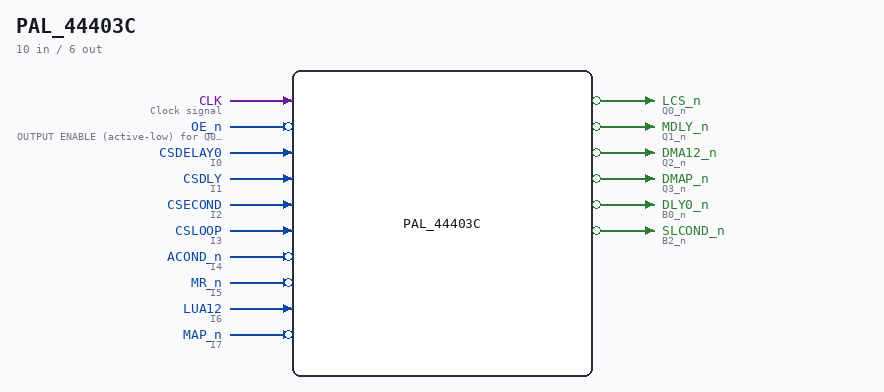

# PAL_44403C

Source: `/mnt/e/Dev/Repos/Ronny/nd-120/Verilog/PAL/PAL_44403C.v`

> Generated by `Verilog/tests/module_doc.py` from the `//!`
> comments in the source. Do not edit by hand - edit the RTL comments and regenerate.

## Description

ND120 PALASM CODE CONVERTED TO VERILOG
Component PAL 44403C
Last reviewed: 2-FEB-2025
Ronny Hansen

## Ports

| Direction | Width | Name | Description |
|---|---|---|---|
| input | `1` | `CLK` | Clock signal |
| input | `1` | `OE_n` *(active low)* | OUTPUT ENABLE (active-low) for Q0-Q3 |
| input | `1` | `CSDELAY0` | I0 |
| input | `1` | `CSDLY` | I1 |
| input | `1` | `CSECOND` | I2 |
| input | `1` | `CSLOOP` | I3 |
| input | `1` | `ACOND_n` *(active low)* | I4 |
| input | `1` | `MR_n` *(active low)* | I5 |
| input | `1` | `LUA12` | I6 |
| input | `1` | `MAP_n` *(active low)* | I7 |
| output | `1` | `LCS_n` *(active low)* | Q0_n |
| output | `1` | `MDLY_n` *(active low)* | Q1_n |
| output | `1` | `DMA12_n` *(active low)* | Q2_n |
| output | `1` | `DMAP_n` *(active low)* | Q3_n |
| output | `1` | `DLY0_n` *(active low)* | B0_n |
| output | `1` | `SLCOND_n` *(active low)* | B2_n |
